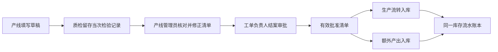

# Production 内部职责与成品入库扩展边界

本文定义 Production 内部代码组织及与 Inventory 的协作边界，遵守[总体架构](../../../../../../docs/architecture.md)。Production 保留生产来源和履约编排，Inventory 唯一拥有库存事实、入库与盘点；仍在模块化单体内共享事务。采购到货检验的 Quality 窄能力按批准设计另行接入。实施项统一维护于[路线图](../../../../../../docs/roadmap.md)。

## 1. 按业务职责组织，保留完整事务

| 职责区 | 负责的业务 | 现有主要入口及后续接入 |
| --- | --- | --- |
| 工单与任务 | 工单、任务、负责人、计划、版本选择及生命周期 | `ProductionService`、工单与批次 Repository；下达前检查负责人 |
| 生产执行 | 派工、报工、异常、返工、工序产品报废及补产授权 | Execution、Reporting、Abnormal、Supplement 用例；保留现有报工限额 |
| 物料需求与履约 | BOM 需求、人工追加、补料需求、关闭／替代、分配及领料履约 | MaterialDemand、Material、DemandCorrection；统一 DemandPlanWriter |
| 任务结案与产出 | 收尾编排、物料核对、产出草稿、线下质检数量确认、结案清单与更正 | Closeout 负责逐项处理，Output 负责草稿／质检／批准清单，CloseoutMaterialLoss 负责不补料损坏，Termination 只读核对 |
| 生产物流编排 | 领料、退料、批准产出的来源资格与原子确认 | FinishedInbound、Outbound、Return 保留来源规则；通过 Inventory 公开能力写入库存；盘点由 Inventory 独立办理 |
| 查询与追溯 | 按工单、任务及单据组合已有事实 | Trace、SupplyDemand 及展示查询；只读，不另建业务状态或账本 |

生产职责共享 Production 数据所有权；库存表所有者见 [Inventory](../../inventory/README.md)。菜单中“仓储”“生产”“报废”的位置不决定后端表归属；`common` 不存业务 SQL、库存规则或状态。跨业务模块依然只经目标模块 `public.ts`，展示查询按既有登记规则只读访问。

当前用例边界：

- `ProductionMaterialService`／`ProductionMaterialRepository` 负责分配；`ProductionMaterialOutboundService`／`ProductionMaterialOutboundRepository` 负责出库。确认出库同时更新出库单、需求余额、批次物料状态、短批授权及补料齐套／补产放行，经 `InventoryStockCommand` 追加库存流水，完整保留单个事务及锁序，不能拆成多个 HTTP 请求或提交后通知。
- `mysql-production-material-persistence.ts` 只共享锁批次、读取计划版本、齐套判断等持久化辅助，不是新业务账本或跨模块端口。追溯和取消前置查询分别调用明确的分配／出库能力。
- 损耗、退料分别使用 `ProductionMaterialLossService`、`ProductionReturnService` 和各自 Controller／窄 Repository；盘点使用 Inventory 的 `InventoryStockCheckService`。保留既有 `/warehouse` 路径与独立权限。成品入库通过独立生产用例校验来源，再调用 `InventoryInboundCommand`，不能恢复无关命令的聚合服务。
- `production.module.ts` 按计划、执行、物料、收尾、仓库、查询六组组织 Controller／Provider 装配，共享 Production 所有权，未增加六个独立模块。业务代码仍遵循 `presentation → application → domain`，infrastructure 实现 port。
- Closeout 保有逐项收尾编排；产出草稿、质检记录与清单更正采用独立用例，后续不继续扩大 `handleImpact` 的事项分支。既有收尾涉及出库、预留、需求和工序的命令事务仍完整保留。

若引入层内功能子目录，例如 `application/closeout`、`infrastructure/warehouse`，须同步导入、所有权检查脚本及所有者文档；目录移动不改变表的写入资格。端口不传递 MySQL 连接，事务复用现有同池事务上下文，不新增通用业务事务框架。

## 2. 结案、审批与入库的连接方式

确定流程见 [ADR-0011](../../../../../../docs/adr/0011-task-closeout-output-list-and-finished-goods-inbound.md)：

- Production 保有草稿、质检确认依据、结案和产出数量；Approval 保有流程、节点、人员解析结果和决定。业务负责人由 Production handler 解析，Approval 不查询工单表。分派设计见[审批设计 §7](../../../../../../docs/approval-design.md#7-业务关联人员分派)。
- 质检以独立业务权限保存当次检验记录，不能编辑产出处置单；产线管理员依据记录修正清单，不能改写检验记录。记录保存任务、当时申报版本／数量、实检结果、记录人、时间和凭据；复检或纠错新增关联记录，不覆盖历史。送审冻结具体引用与最终数量，改量不相符时不得静默沿用旧记录，审批人同时核对双方。此能力是 Production 结案的轻量依据，不建设完整 Quality 或通用质检审批节点。
- 批准清单是入库资格与数量上限的依据，库存流水是实际收货事实。审批通过不调用库存写入，不用报工量推算实际入库，不随库存被领用恢复入库额度。
- 两类产出各自收齐后一次确认，分别形成单据与库存批次；草稿可修改，不允许一类批准数量分多次确认。一类完成不要求另一类同时完成，零数量不建入库。针对计划内／计划外可入库数量，更正时已确认类别的批准数量保持不变，只更正未入库类别，不能通过增大已入类别的批准量继续追加收货；报废等非入库信息仍按清单更正留存依据及审批。
- 确认成品入库作为单个事务：锁任务及当前清单／类型资格，复核批准版本、在审冻结和数量，再确认入库单、库存批次／流水与成功审计；沿用幂等及唯一约束防重。清单更正与入库使用兼容锁序，锁序与唯一键见[成品入库](database/finished-goods-inbound.md)。
- 清单更正只更新未收货产出的合法依据并保留旧批准版本；已入库错误的冲销尚未开放，不得借更正数量删除或覆盖库存事实。

## 3. 报废与损耗按来源区分

| 场景 | 所属职责 | 数量影响 |
| --- | --- | --- |
| 工序产品报废 | 生产执行／异常处置 | 保留产品报废事实，按现有规则产生补料与产品补产授权 |
| 最终新增产品报废 | 任务结案／产出清单 | 只记录此前未记录部分，与历史工序报废去重；不补料、不补产、不增减库存 |
| 已领物料损耗 | 物料去向／损耗用例 | 占用可退额度；现有确认产生等量损耗补料，不再次扣仓库库存 |
| 收尾损坏物料且不补料 | 独立 CloseoutMaterialLoss 用例 | 正常／提前初次结案送审前明确登记，复用原 `item_scrap` 不可变事实并永久占用可退额度；不调用在产补料确认，不增减库存 |
| 仓库内库存报废 | 未批准的后续库存场景 | 将涉及真实库存扣减；本阶段不开放 |

补料管理与损耗查询页仍安排在全部成品入库完成之后。它们组合已有单据与追溯，不接管需求事实，也不把产品报废和原材料损耗混合求和。不得仅因需要一个“报废管理”页面就新建通用 Scrap 模块或通用报废写入口。

## 4. 成品与物料共用库存账本

现有 `item_id` 指向物料、`material_variant_id` 标识精确版本，不能把成品 ID 塞入原外键或简单把版本改为可空。设计须同时覆盖成品身份、批次、入库明细、库存流水、余额投影、来源任务及批准清单引用；原料与成品共用唯一 `inventory_transaction` 事实账本。

成品通过显式 product_id 分支、互斥 CHECK 和组合外键接入，物料分支继续强制 item_id/精确版本非空。生产流转 self_made 与 production_extra 分别形成批次，模型见[库存所有者文档](database/inventory-ledger-and-inbound.md)与[成品入库](database/finished-goods-inbound.md)。物料领料、退料、盘点的现有精确版本约束不能因成品接入而被削弱。不为成品建立另一套数量账本、兼容影子表或双写。

## 5. 库存模块与采购接入边界

Inventory 已拥有现有库存表及 SQL 写入入口。逐表所有权、公开方法与锁序见[库存提取设计](../../../../../../docs/inventory-extraction-design.md)；采购／检验范围模型见[采购技术设计](../../../../../../docs/procurement-inbound-technical-design.md)。成品按类别一次确认和生产退料语义保留；旧手工外购创建、确认和取消 POST 路由已移除，原 GET 仅查询实际入库历史，新外购必须来自采购和检验放行。

采购接入按[路线图](../../../../../../docs/roadmap.md)推进；两类来源、强制检验和检验后入库见 [ADR-0013](../../../../../../docs/adr/0013-procurement-source-and-stock-boundaries.md) 与[业务设计](../../../../../../docs/procurement-inbound-design.md)。模块边界保持如下约束：

- Inventory 单独维护库存表、入库单与盘点；Production 领料、退料及成品编排只调用其公开能力，登记的展示查询不得借只读例外写表或加锁。
- 跨模块协调仍保留现有原子事务与锁序，库存能力不反向决定生产需求、补产和结案，生产用例负责编排。
- 新采购和 Quality 仅接入已批准采购入库范围，不扩展销售、仓库报废、完整质量体系或新的库存账本。

采购到货及检验前实物不属于库存，采购 Quality 不接管 Production 的结案质检或批准产出。用户未要求进入正式测试阶段前不新增测试集；编码阶段继续类型检查、构建和手工验收，不能把暂缓测试表述为已经全量验证。
