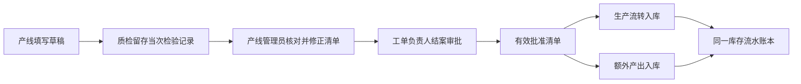

# Production 内部职责与成品入库扩展边界

本文定义成品入库前的代码组织与扩展边界，遵守[总体架构](../../../../../../docs/architecture.md)。当前仍是一个 Production 业务模块；下列职责区用于组织用例和持久化能力，不建立独立 Inventory、Quality 模块。实施项统一维护于[路线图](../../../../../../docs/roadmap.md)。

## 1. 按业务职责组织，保留完整事务

| 职责区 | 负责的业务 | 现有主要入口及后续接入 |
| --- | --- | --- |
| 工单与任务 | 工单、任务、负责人、计划、版本选择及生命周期 | `ProductionService`、工单与批次 Repository；下达前检查负责人 |
| 生产执行 | 派工、报工、异常、返工、工序产品报废及补产授权 | Execution、Reporting、Abnormal、Supplement 用例；保留现有报工限额 |
| 物料需求与履约 | BOM 需求、人工追加、补料需求、关闭／替代、分配及领料履约 | MaterialDemand、Material、DemandCorrection；统一 DemandPlanWriter |
| 任务结案与产出 | 收尾编排、物料核对、产出草稿、线下质检数量确认、结案清单与更正 | Closeout、Termination；新清单作为独立用例接入，不继续堆入收尾事项处理分支 |
| 仓库操作与库存 | 入库、领料的库存记账、退料、盘点、批次与库存流水 | Inbound、Return、StockCheck；后续接入批准清单的两类成品入库 |
| 查询与追溯 | 按工单、任务及单据组合已有事实 | Trace、SupplyDemand 及展示查询；只读，不另建业务状态或账本 |

这些职责共享 Production 数据所有权。菜单中“仓储”“生产”“报废”的位置不决定后端表归属；`common` 不存业务 SQL、库存规则或状态。跨业务模块依然只经目标模块 `public.ts`，展示查询按既有登记规则只读访问。

当前用例边界：

- `ProductionMaterialService`／`ProductionMaterialRepository` 负责分配；`ProductionMaterialOutboundService`／`ProductionMaterialOutboundRepository` 负责出库。`mysql-production-material-outbound.repository.ts` 的确认出库同时更新出库单、需求余额、库存流水、批次物料状态、短批授权及补料齐套／补产放行，完整保留单个事务及锁序，不能拆成多个 HTTP 请求或提交后通知。
- `mysql-production-material-persistence.ts` 只共享锁批次、读取计划版本、齐套判断等持久化辅助，不是新业务账本或跨模块端口。追溯和取消前置查询分别调用明确的分配／出库能力。
- 损耗、退料、盘点分别使用 `ProductionMaterialLossService`、`ProductionReturnService`、`ProductionStockCheckService` 和各自 Controller／窄 Repository；保留既有 `/warehouse` 路径与独立权限。新成品入库应以自己的用例接入，不能恢复无关命令的聚合服务。
- `production.module.ts` 按计划、执行、物料、收尾、仓库、查询六组组织 Controller／Provider 装配，共享 Production 所有权，未增加六个独立模块。业务代码仍遵循 `presentation → application → domain`，infrastructure 实现 port。
- Closeout 保有逐项收尾编排；产出草稿、质检记录与清单更正采用独立用例，后续不继续扩大 `handleImpact` 的事项分支。既有收尾涉及出库、预留、需求和工序的命令事务仍完整保留。

若引入层内功能子目录，例如 `application/closeout`、`infrastructure/warehouse`，须同步导入、所有权检查脚本及所有者文档；目录移动不改变表的写入资格。端口不传递 MySQL 连接，事务复用现有同池事务上下文，不新增通用业务事务框架。

## 2. 结案、审批与入库的连接方式

确定流程见 [ADR-0011](../../../../../../docs/adr/0011-task-closeout-output-list-and-finished-goods-inbound.md)：

- Production 保有草稿、质检确认依据、结案和产出数量；Approval 保有流程、节点、人员解析结果和决定。业务负责人由 Production handler 解析，Approval 不查询工单表。分派设计见[审批设计 §7](../../../../../../docs/approval-design.md#7-业务关联人员分派扩展待实施)。
- 质检以独立业务权限保存当次检验记录，不能编辑产出处置单；产线管理员依据记录修正清单，不能改写检验记录。后续实现须保存任务、当时申报版本／数量、实检结果、记录人、时间和凭据；复检或纠错新增关联记录，不覆盖历史。送审冻结具体引用与最终数量，改量不相符时不得静默沿用旧记录，审批人同时核对双方。此能力是 Production 结案的轻量依据，不建设完整 Quality 或通用质检审批节点。
- 批准清单是入库资格与数量上限的依据，库存流水是实际收货事实。审批通过不调用库存写入，不用报工量推算实际入库，不随库存被领用恢复入库额度。
- 两类产出各自收齐后一次确认，分别形成单据与库存批次；草稿可修改，不允许一类批准数量分多次确认。一类完成不要求另一类同时完成，零数量不建入库。针对计划内／计划外可入库数量，更正时已确认类别的批准数量保持不变，只更正未入库类别，不能通过增大已入类别的批准量继续追加收货；报废等非入库信息仍按清单更正留存依据及审批。
- 确认成品入库作为单个事务：锁任务及当前清单／类型资格，复核批准版本、在审冻结和数量，再确认入库单、库存批次／流水与成功审计；沿用幂等及唯一约束防重。清单更正与入库使用兼容锁序，具体锁和唯一键在数据库设计阶段定稿。
- 清单更正只更新未收货产出的合法依据并保留旧批准版本；已入库错误的冲销尚未开放，不得借更正数量删除或覆盖库存事实。

## 3. 报废与损耗按来源区分

| 场景 | 所属职责 | 数量影响 |
| --- | --- | --- |
| 工序产品报废 | 生产执行／异常处置 | 保留产品报废事实，按现有规则产生补料与产品补产授权 |
| 最终新增产品报废 | 任务结案／产出清单 | 只记录此前未记录部分，与历史工序报废去重；不补料、不补产、不增减库存 |
| 已领物料损耗 | 物料去向／损耗用例 | 占用可退额度；现有确认产生等量损耗补料，不再次扣仓库库存 |
| 收尾损坏物料且不补料 | 后续物料处置用例 | 结构化损坏事实与可退额度规则须单独设计，不能调用现有损耗补料确认代办 |
| 仓库内库存报废 | 未批准的后续库存场景 | 将涉及真实库存扣减；本阶段不开放 |

补料管理与损耗查询页仍安排在全部成品入库完成之后。它们组合已有单据与追溯，不接管需求事实，也不把产品报废和原材料损耗混合求和。不得仅因需要一个“报废管理”页面就新建通用 Scrap 模块或通用报废写入口。

## 4. 成品库存身份是入库编码前置

现有 `item_id` 指向物料、`material_variant_id` 标识精确版本，不能把成品 ID 塞入原外键或简单把版本改为可空。设计须同时覆盖成品身份、批次、入库明细、库存流水、余额投影、来源任务及批准清单引用；原料与成品共用唯一 `inventory_transaction` 事实账本。

该模型连同生产流转来源编码及 `production_extra` 约束在[库存所有者文档](database/inventory-ledger-and-inbound.md)定稿，再追加 migration。物料领料、退料、盘点的现有精确版本约束不能因成品接入而被削弱。不为成品建立另一套数量账本、兼容影子表或双写。

## 5. 何时提取独立库存模块

当前先明确内部库存写入入口与用例边界。出现销售、委外等 Production 之外的实际库存消费者，或库存有独立且已批准的生命周期时，再评审 Inventory 的整体所有权迁移，保持模块化单体：

- 明确单一库存表所有者及公开命令／查询能力，移走旧写入口，更新所有权登记，不让两模块同时直接写账本。
- 跨模块协调仍保留现有原子事务与锁序，库存能力不反向决定生产需求、补产和结案，生产用例负责编排。
- 仅按已批准范围提取既有能力；不附带销售、仓库报废、质量、采购或新的库存账本。

当前阶段以职责拆分、负责人分派、产出清单、成品身份及入库逐步推进。用户未要求进入正式测试阶段前不新增测试集；类型检查、构建和手工验收继续执行，不能把暂缓测试表述为已经全量验证。
