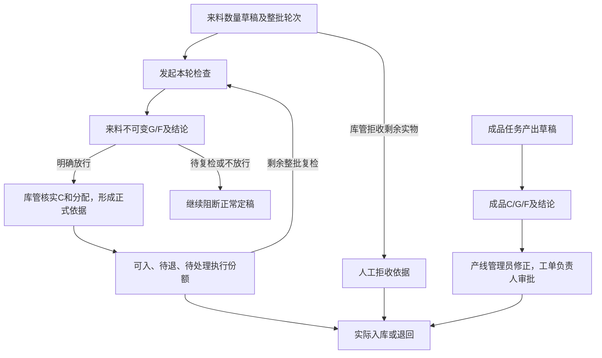

# 统一检验模型

本文维护两种来源共用检验事实时的职责对照。成品完整数量及请求规则见[成品检验](finished-inspections.md)，来料数量授权见[正式清单](../../procurement/docs/receipt-acceptance.md)，字段及条件约束见[数据库](database.md)；决策理由见 [ADR-0015](../../../../../../docs/adr/0015-unified-quality-quantity-semantics.md)。

## 所有权和流转

Quality 两表共享检验办理与不可变G/F事实。Procurement 拥有到货、实收修订、整批处理轮次、正式清单及执行范围；Production 拥有产出草稿、审批及批准清单；Inventory 只记录真实库存。来源类型不替代真实组合FK，不把不同物料或供应商拼成万能检验主单。

来料全检和抽检都判断本轮整批实物资格，样本不是独立处置份额。复检在开始前替代本批所有尚未实际处置范围，统一形成新轮；已经入库或退回的事实不变。旧记录不能重新消费，不相加历史正式清单。

来料首次、复检均有明确开始动作。Quality case 的 completed 表示检查事实已完成；来源round分别表达待复检、不放行、待核对定稿。`superseded`办理只表示未完成检查已因来源更正或拒收失效，迟到提交直接拒绝，无新结果。

## 数量授权

下表为当前实现。成品数量建议不阻断定稿；部分已入后的固定基准、剩余范围快照及复检开始冻结仍见[CQ-01](../../../../../../docs/documentation-conflicts.md#cq-01)。

| 项目 | 来料 | 成品 |
| --- | --- | --- |
| 质检填数 | 全检/抽检G、F，自动N=G+F | 全检G/F；抽检还需独立C |
| 整批C | 库管正式清单确认 | Quality记录测量值 |
| 明确放行后建议 | 全检建议G；抽检建议C−F | 全检建议G；抽检建议C−F |
| 超建议 | 库管非空依据负责，原G/F不可覆盖，分配总和仍=C | 不阻断定稿；保留原说明和负责人审批，不新增强制超建议说明 |
| 数量异常 | 定稿提示C与D、全检N与C或抽检N>C，并要求核对依据 | 原申报与实检、清单与建议不一致提示核对；计数合法性、计划内上限及已入类别锁量仍校验 |
| 零量 | 实收纠错，无零件检验 | 保留zero_confirmation |

抽检N小于申报D是正常情况，不能当整批短少；N>C或C<F时不显示负数/有效建议，库管必须说明异常。待复检/不放行不能通过数量例外授权可入。人工拒收是独立仓库决定，可未检就发生，不冒充F或实际退回；迟到检查不能恢复拒收后的执行资格。

到货120、全检118/2可定稿原单100、承接已到货补单18、待退2；这些属于同批处置分配。复检一起暂停剩余份额，保持采购归属。定稿按本次检查修正同批计数不自动发起另一轮质检；独立实收更正才重走新数量草稿。

成品由Production核对清单并送负责人审批，实际入库受有效正式批准数量约束。两来源共享事实表不意味着共享全部输入及依据要求，来料的强制超建议说明不自动套用于成品。

**成品剩余复检目标，待实施**：固定已入基准、剩余范围和开始冻结未随当前数量建议功能一并落地，完整定义统一见[成品专题](finished-inspections.md#部分已入后的复检已确认目标待实施)，实施与验收见[路线图](../../../../../../docs/roadmap.md#cq-01成品剩余复检整改)。
