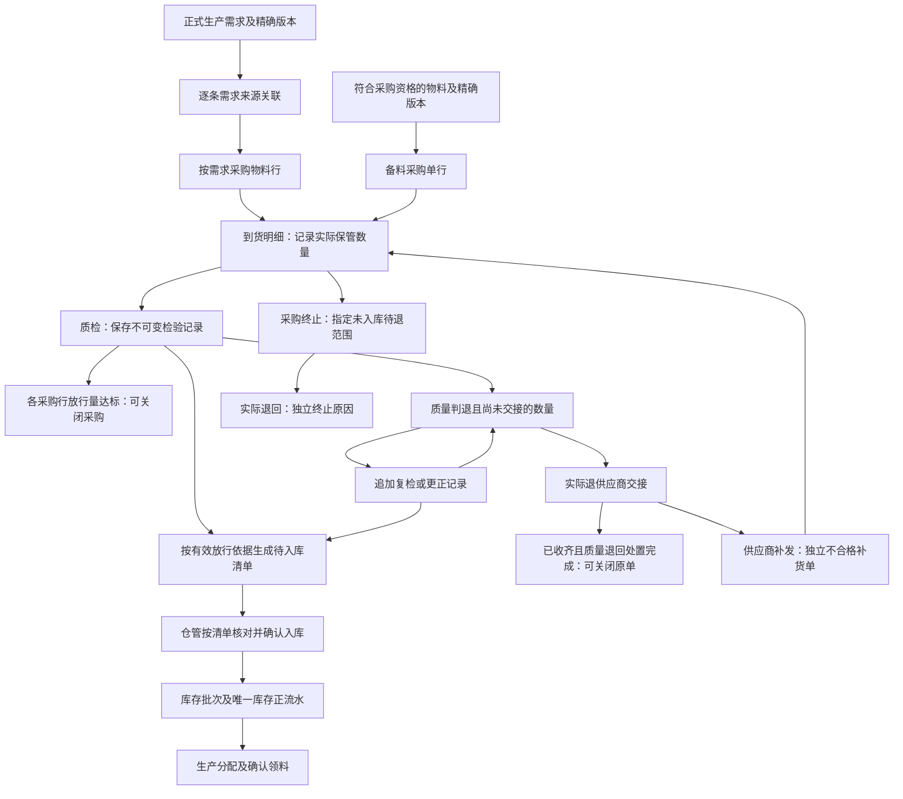

# 采购与外购物料入库质检设计

状态：一期业务边界已收敛，进入阶段 2 技术设计。业务决策见 [ADR-0013](adr/0013-procurement-source-and-stock-boundaries.md)；本文中的表名、字段、查询及交互建议仍须技术定稿，不表示已实施。采购、独立 Inventory 和 Quality 尚未实现，实施次序及完成条件见[路线图](roadmap.md)。

本文只覆盖外购物料 `purchased`。现有 Production 结案质检、批准产出和成品每类别收齐一次入库继续由原所有者负责，不套用本流程。

## 1. 已确定的边界

- 既定的任务需求采购关联具体 `production_item_demand.id`，继承精确物料版本；该入口须先形成正式需求。备料采购自行选择符合采购资格的精确版本，不依赖工单、任务或 BOM。目标规则中物料版本停用不阻断采购或入库，生产出库限制及当前实现差异见 §2.9；不能继续把“符合采购资格”写成“版本必须启用”。“批量工单已选版但任务需求尚未形成”的工单来源采购一期后置，提前备货使用独立备料采购。
- 备料采购的物料及精确版本在采购单草稿中从物料主数据选择，不继承工单选版、不要求工单／任务／需求 ID；正式下单时锁定采购行所选身份与版本。名称遵守当前主数据展示规则，物料编码、单位、版本及数量按公共快照规则固化；后续任务需求形成不自动给备料单补绑来源。
- 实际供应商与采购量由采购确定，采购数量与来源需求数量不绑定、不分摊，也不以需求量设置订购上限。一条采购物料行可订购 600 并关联未领 200／300 的两条需求；关联只用于追溯和前端提示，不宣称每条需求分别采购了多少。下单不预留，到货和入库不减少生产需求；生产仍通过分配、确认领料履约。
- 同一供应商的采购允许跨工单、跨任务合单，保留每条来源需求的稳定 ID，不限制在一个工单内。“补单原因”区分超量补单／不合格补货，并关联原采购、到货或退回依据；来源关联不驱动采购自动取消。
- 补单复用采购表结构和办理流程，但每次创建独立采购主单、ID 和单号，数量及履约进度独立，不给原采购单追加数量。需求与采购物料行通过逐条映射关联，同一需求可同时展示原采购单和补单；两张单的关联不能合并成一张单的状态。
- 一期采购不接在线审批。草稿可修改，采购正式确认下单后锁定供应商、物料及精确版本、计划量；关键内容录错通过取消／结束后重建处理，不原位改变既有订购依据。无到货可取消，已有到货保留原事实并按既定关闭及处置规则办理。
- 实收数量由仓管按本次实际接受并进入待检保管的数量登记，不受采购计划量封顶；仍遵守正整数、存储范围和实物真实性。免费超量可以直接归原采购单，也可由人员决定另单承接；收费超量由仓管与采购线下决定是否接受，决定额外购买时另建超量补单，否则拒收。系统不因数量超过计划自动拆单，不扩展价格结算模块。
- 不合格退回后的供应商补发由独立补单承接，原因使用“不合格补货”；采购同意额外购买多发实物时，新单原因使用“超量补单”。两种原因须分别关联真实原记录，不把不合格补发继续挂原单以凑足原计划。免费超量直接归原单时，仍保留超收说明和来货依据；不能覆盖旧到货或检验记录，也不能将同一实物在新旧单重复登记。
- 需求选择采用“工单 → 任务 → 需求明细”分组，支持展开和跨工单勾选；选后按物料及精确版本汇总采购物料行，可展开来源，采购量独立填写。需求行只显示“关联采购 N 单”，点击查看采购物料行数量和状态，不计算“本需求已采购量”。这些交互方向已认可，尚未实现或完成 UI 验收。
- 采购候选同时看任务状态和具体需求有效性；“已领料／生产中”任务仍可能新增人工追加或补料需求，不能只展示尚未领料的任务。完整状态白名单、失效提示及分页细节仍按 §2.5—§2.7 评审；已有采购只作提示，不因关联过采购就自动排除有效需求。
- **检验后入库**：到货登记实物及待检数量，不写库存流水，也不计入库存余额；检验合格后由仓管确认实际入库，才形成 `available` 正流水。待检实物属于到货保管记录，不属于 `pending_inspection` 库存。
- 所有外购物料均须检验，不设免检。质检人员确认数量、结论、说明和凭据；未入库数量可追加复检或更正，不覆盖历史记录。不合格退供应商必须记录实际交接，不能只凭检验不合格就视为已经退走。
- 检验时明确选择全检或抽检。全检记录实际合格／不合格数量；抽检记录样本数量、样本内不合格数量并展示抽检比例。质检通过“批准入库”字段明确放行；抽检可剔除已发现的不合格品后批准剩余整批入库，也可要求全检或整批退回。样本结果与整批处置结论分别保留，具体数量规则见 §3。
- 采购 500、实际送来 510：免费且决定全部接收，可在原单登记 510；额外 10 收费且采购同意购买，则新建 10 的超量补单，按原单 500／补单 10 分开登记。若收货现场拒收额外 10，则只登记接受的 500；若已确认实收 510 后才退回 10，须保留实收 510 并记实际退回，不能倒改为 500。
- 不合格实物由仓管线下退回供应商并留实际交接记录。供应商后续补发时，新建独立不合格补货单，再登记到货、重新检验、入库；退回不冲减原累计实收，新补单数量也不回填原单。正常尚未交付的后续到货仍可归未关闭原单，与针对已退不合格品的补发分开。
- 补购量由仓管现场核实后告知采购填写，须对应本次实际补发或采购同意接收的额外实物。系统不按原需求量、原采购量或实际退回量计算强制补购额度，不设置异常次数上限；这不表示可以任意混填原因和数量。原单及补单均不设实收计划上限，质检只覆盖已登记实物，入库和退回仍不得越过其有效依据或重复记账。
- 到货详情独立展示退回处理状态，以“未处理／已退回供应商”表达实际进度，同时保留应退及实际退回数量、人、时间和交接凭据。一期不允许分次退回，当前待退范围须全部实物交接后一次确认，不设置“部分退回”状态。状态由真实退回事实决定，不用质检是否批准入库代替；有合格批准数量时不等待不合格部分退走才允许入库。
- 已入库数量锁定检验结果；一期不提供已入库数量的采购退货或检验更正。复检或更正仅作用于尚未入库、尚未退回的实物，不能把已处置部分重新变成待入库额度。
- 质检可主动发起复检／检验更正，明确确认发起时将所选未处置范围置为复核中，并立即暂停该范围的入库和实际退回。完成后追加结论并更新待办，旧事实保留；复核中由显式办理状态判断，不由版本号差异推断。具体流程见 §4.4，不增加审批，也不开放已入／已退份额或采购终止待退范围的复检放行。
- 允许分次入库，默认剩余有效批准量、允许调小；每个到货首次实际确认自动生成固定内部批次，后续沿用。内部批号写现有 `item_batch.batch_code`，各次 `inbound_detail.batch_id` 引用同一 `item_batch.id`，供应商批号另存。
- 实收录错保留修订并由质检复核；已有入库／退回时只更正不影响已处置事实的同批剩余范围。采购关闭后也可办理，保留关闭历史且不自动重开，不能借更正登记后来新到货。
- 已确定采购完成不等待实际入库：各物料行有效质检放行量达到计划量时，可按质检达标关闭；已收齐且完成检验、不合格范围已全部实际退回时，也可按质量退回处置完成关闭，不因放行量不足把它误记成少收。后者不等待供应商决定补发、新补单创建或履行。真正少收仍可继续等货或由有权限人员留原因结束，无到货可填写原因取消。“可以关闭”不直接等于自动关闭，具体确认交互由技术设计细化。
- 采购关闭后停止新增到货，已有到货的检验、更正、待入库与待退回继续独立办理；待入库清单是仓库待办，其完成不再作为采购关闭前置。允许未检或合格但尚未入库的实物因采购终止实际退回，单独记录“采购终止退回”，不能伪造质量不合格。采购完成与到货实物全部处理完分别展示，关闭依据及更正后差异见 §4.1。
- 关单由有权限人员明确确认，支持逐物料行结束；全部行结束后主单关闭。已结束行停止收货，其余未结束行可继续接收正常未交付数量，不因其中一行达标自动关闭整单。
- 一期所有外购到货均须有采购来源；旧手工外购入库入口切换为选择采购及其放行清单，不保留无采购单的外购到货或直接入可用库存入口。已关闭采购的有效放行范围仍可办理入库。
- 一期暂按质检至入库无实物损耗处理，不新增损耗字段或用关闭备注消除实物差额。实际入库小于采购计划可能由未到余量结束或不合格退回造成，不自动解释为损耗；数量核对见 §3.4。
- 一期供应商只有名称及稳定 ID，系统补齐公共审计、并发和软删除字段；不增加联系人、附件、评审或物料绑定。
- 仍为一个 API、一个数据库；库存只有 `inventory_transaction` 一份事实。Inventory 提取前由 Production 所有，目标表归属必须经过阶段 2 评审后整体切换。

## 2. 单据关系与办理流程

以下是逻辑关系；跨工单合单、物料行独立填写采购量以及需求只保留来源追溯已确定。未关闭采购的正常未交付余量可继续收货，已经包含允许多次到货；分次入库及固定批次规则已确定。表字段与交互细节按 §7 技术定稿，尚未实施。



| 对象 | 引用与责任 | 不能替代的事实 |
| --- | --- | --- |
| 采购单／物料行 | 供应商、采购类型、物料、精确版本、采购独立填写的计划数量；逐行判断质检达标、质量退回处置完成或人工结束 | 采购数量不是需求剩余量或实收上限，采购完成不等于仓库待办完成 |
| 需求来源关联行 | 每行关联一个采购物料行与一个具体需求 ID，保留多条来源，不记录采购分摊量；普通备料行无需求来源 | 来源可多对多，不将 ID 数组保存为数据库业务关联，也不形成库存预留 |
| 到货单／明细 | 引用具体采购行，登记实收数量、日期、办理人及供应商批号等必要追溯资料 | 到货登记不是库存入库 |
| 检验记录 | 引用到货明细及本次检验覆盖范围；保存数量、结论、说明、凭据、记录人／时间及前次记录引用 | 检验合格不是已确认入库 |
| 待入库清单 | 按当前有效质检放行范围展示批准量、累计已入库及剩余待办；采购关闭后仍可办理 | 不另设仓管可随意编辑的批准总量，不形成第二份库存事实；是否独立存表在阶段 2 定稿 |
| 退供应商交接记录 | 在到货详情保留对应质量判退或采购终止处置依据、应退量、实际退回量、处理状态、时间、办理人和交接凭据；实物线下退回 | 不合格数量不是已退数量，退回处理状态不是入库批准状态，不要求因此建设完整退货模块 |
| 入库单／明细 | 引用到货明细与实际采用的检验依据，记录本次实际入库量及库存批次 | 采购来源不构成生产专属库存 |
| 库存批次／流水 | 明确物料及精确版本；流水引用入库明细，同事务维护余额投影 | 库存批号不是采购行或检验记录 ID |

### 2.1 合单与生产需求的关系

“跨任务合单”指采购向同一供应商下一个采购单，单内保留多个任务的来源行。例如任务 A 需物料 M 的 v1 版本 200，任务 B 需同版本 300，可形成一个采购单、两条需求来源。合单不合并生产需求，也不表示以后入库的 500 必须分别预留给 A／B。

**已确定同一供应商可以跨工单合单，不增加仅同一工单的限制。** 一条采购物料行保存同一精确版本的实际订购量，多条需求来源行分别记录来源 ID，不按需求分摊该数量。采购人员直接填写该物料的订购总量；到货、检验围绕采购物料行及实际来料批次办理，不必为了来源属于不同任务而拆成重复采购物料行。关系结构与页面方案见 §2.3—§2.6，具体字段和交互在所属阶段定稿。

采购来源与采购生命周期分开：生产任务取消、结束、需求关闭或替代只改变来源提示，不自动取消、减量或改绑已经下单的采购。由具有处置权限的采购／仓管人工决定继续接收公共备料或结束后续到货。人工追加需求在真实发生时生成新的需求行，可再次采购；不要求首次下单时预知未来追加，也不限制一个任务或需求只能采购一次。重复采购进度应可见，但采购量不强制等于需求量。

当前两类初始正式需求都在任务完整确认环节生成：批量工单在已下达／生产中保存 BOM 各基础物料的精确版本配置，任务继承该配置，以 BOM 单耗乘任务计划量确认需求；研发任务在此环节选择精确版本并可拆量。创建任务不等于已形成正式需求，工单选版也不是下单时自动锁定一套“BOM 版本”。当前 BOM 为产品级单一、批准后永久只读，工单保存的是精确物料版本选择，详见[工单设计](../apps/api/src/modules/production/docs/database/work-orders-and-batches.md)及[需求设计](../apps/api/src/modules/production/docs/database/demand-allocation-and-outbound.md)。批量工单在尚未形成任务需求时直接发起工单采购的入口一期后置；不能通过伪造任务需求解决，也不能把“关联来源”解释为“任务变化自动撤销采购”。

这里“工单提前采购”专指新增一种**尚无正式任务需求时，直接按工单及其选版生成、关联采购**的入口。例如批量工单已选好物料版本，但尚未确认任务需求，此时按工单选料下单属于该扩展。现有一期备料采购完全不依赖工单、任务、需求或 BOM：由采购人员在草稿中从物料主数据选择物料与精确版本，并填写供应商及数量，正式下单时锁定；即使尚无工单也可以先采购。它不继承工单选版，不自动成为某工单的需求采购，不伪造需求 ID，也不在未来生成需求时自动回绑或分摊。

一条到货明细建议只属于一个采购物料行、一个精确版本及一个实际来料批次；不同版本或供应商实物批次拆行。若同一采购物料行关联多个需求，到货和检验数量只计一次，不能为每条需求来源重复建立同批检验或重复累计放行量；若实际来料跨不同采购物料行，检验分组粒度仍须定稿。

### 2.2 补单原因与来源

“按需求／备料”表示采购来源，**“补单原因”已确定区分超量补单和不合格补货，并关联原记录**；不把“不合格补货”硬塞成与前两者互斥的第三种来源。普通采购无补单原因。补单与普通采购共用表结构、编号规则和办理流程，**每次补单是独立的新采购单，有自己的 ID、唯一单号、物料行、订购数量与到货／检验／入库进度**；新单实物只登记在新单下，不修改原单计划量，也不另建一套补货账本。不合格退回后的补发须由新单承接，即使原单尚未关闭也不追加到原单凑足合格数。

| 原因 | 现场事实及决定 | 补单数量与追溯 |
| --- | --- | --- |
| 不合格补货 | 因不合格实际退回 10，供应商本次补发 10，仓管核实并通知采购 | 创建 10 的独立不合格补货单，关联原采购、到货及质量退回。原单已收齐且退回处置完成即可关闭，不等待补发，不重用原质检额度 |
| 超量补单 | 供应商额外多发 10，采购决定接受额外实物，包括同意额外付费购买 | 创建 10 的超量补单，关联原采购及来货依据。免费超量仍可按既定规则直接记原单，不因仅仅超量而由系统强制拆单 |

一批现场来货若同时包含实际补发与额外多发，分别辨明实物、原因和依据再登记，不把全部数量归到某一个补单原因。正常后续交付、免费超收及独立补单到货都保留本次业务说明和相应原记录依据，具体字段在阶段 2 定稿，不预建价格或结算模块。不合格补货不得笼统表示另行接受的采购增量。确认实收前确定单据归属；同一实物不能同时在原单和补单确认，已确认后要改归属须按到货纠错规则办理，不能复制一笔到货。

原单仍有尚未交付数量且允许收货时，后续正常交付继续登记在原单；采购已经关闭后，已有实物的后续检验、入库、退回可以继续，新来料须有新的有效采购来源。不合格补发无论原单是否已关闭均新建补单，不重开或改写原单。是否提供其他显式重开采购属于后续额外选择，本期不默认提供或自动重开。

到货登记只记录本单最终同意接收并进入待检保管的实物。送来 510、现场拒收额外 10 时可登记 500；已确认接收 510 后再退回 10，必须保留实收 510 和实际退回 10，不能通过少填或倒改实收掩盖交接。收费与免费只是线下业务决定的说明，不使未经质检的实物获得入库资格。

两种追溯关系分别表达不同含义：

- **需求来源映射**：采购物料行关联哪些需求，回答“与哪些工单／任务的需求有关”。原单和补单分别拥有自己的映射行，同一需求能关联多张采购单；不复制需求、不记录采购分摊数量。
- **补单原始依据**：新采购物料行关联原采购物料行以及相关到货／退回记录，回答“为什么另建这张采购单”。超量补单引用原采购行及相关来货，不合格补货引用原采购行、到货和实际退回记录。仅让新旧单关联相同需求，不能代替这条异常来源链。

从原采购物料行发起补单时，建议带入该行对应的需求来源，在新物料行下保存新的映射，原单映射保留；不能将原采购单其他物料行的需求一并挂入。若原行为备料且没有需求来源，补单也不凭空生成需求。源需求已取消／关闭时，映射仍表达历史来源，新补单的办理资格依据原采购和异常事实另行定义；不得仅为了建立来源关系重新激活旧需求。具体原始依据采用哪些外键或关联明细、能否将多项异常合为一条补单物料行，在阶段 2 定稿，不增加异常补购数量或次数限制。

新建补单仍须校验供应商、物料身份、精确版本匹配及数量正整数／存储范围；已有相关补单供人员核对，不以原退回量建立强制补货额度，也不因同一异常已有补单就禁止再建。请求幂等防同次提交重放，实际入库／退回仍须防重复消费实物；这些技术校验不等于限制采购人工填写的业务数量。若原生产需求已关闭，建议通过独立补单动作引用原采购／异常事实，原需求只保留追溯，不强迫重新激活需求；具体资格随 §4.1 定稿。补单不生成生产补料需求或补产授权，财务结算不在本期范围。

现有手工外购入库的 `batchCode` 为手工填写，系统按同版本同批号创建或复用库存批次；可自动生成的是入库单号，不是该手填库存批号。新采购流程已确定每个到货明细固定一个系统内部批次，首次实际入库时自动生成并写入现有 `item_batch.batch_code`，之后分次入库复用同一 `item_batch.id`，供应商批号单独保存。具体方案见 §2.10，不仅凭相同供应商批号跨到货自动合并。

### 2.3 采购物料行与需求来源行

本节表达已确定的独立采购数量与逐条来源追溯，尚未创建表或接口；表名仅用于表达职责，具体字段与约束在阶段 2 定稿，不是已发布契约。

| 对象 | 示例数据 | 职责 |
| --- | --- | --- |
| 采购主单 `purchase_order` | P1，供应商甲，按需求采购 | 维护采购自身状态及办理资料 |
| 采购物料行 `purchase_order_line` | L1 → P1，物料 M／v1，订购 600 | 表达实际向供应商购买的对象与数量，承接到货、检验和入库追溯 |
| 需求映射行 `purchase_order_line_source` | L1 → D1；L1 → D2，分别保存两行 | D1 来自工单 A／任务 A1，D2 来自工单 B／任务 B1；每行只有一个需求 ID |

该方案中一条采购物料行可关联多个需求，一条需求也可关联多次采购；来源关系表是采购自身的追溯关系，不复制或重建 `production_item_demand`。同一采购物料行与同一需求的重复关联应由唯一约束禁止，但不能把 `demand_id` 全局唯一而禁止后续再次采购。按需求的普通采购行须有合法来源，备料行不伪造来源；补单从原采购事实追溯，源需求失效时的资格按 §2.2 单独明确。

例如原采购单 P1 的物料行 L1 关联 D1、D2，后续补单 P2 的新物料行 L2 承接该行的异常，映射可为：

| 采购物料行 | 需求 ID | 所属采购单（通过物料行查询） |
| --- | --- | --- |
| L1 | D1 | P1 原采购单 |
| L1 | D2 | P1 原采购单 |
| L2 | D1 | P2 补单，独立单号 |
| L2 | D2 | P2 补单，独立单号 |

需求 D1 的“相关采购”显示 P1、P2 两张单及各自的数量／进度，并标明 P2 的补单原因；这不表示 D1 分别独占两行订购数量。L2 还须保留对应 L1 及来货／退回的原始依据。物料行已经能解析采购主单，映射不为展示重复存第二份可修改的采购单归属。

API 请求／响应可以使用数组，例如一个物料行下有 `sources: [{ demandId: "D1" }, { demandId: "D2" }]`；数组只用于传输和渲染。数据库逐行保存关联，不用 JSON 数组或逗号字符串代替关系。正式下单须在事务内复核所有来源物料与精确版本一致、来源资格有效，并一次保存单据、物料行、来源及成功审计。

**来源只追溯，不保存采购分摊量或分摊比例。** D1 未领 200、D2 未领 300，本次仍可以订购 600，不自动按比例分成 240／360，不强制合计等于 500，也不从需求表扣减 600。需求变化只更新提示，不能静默调整草稿里已经填写或正式下单的采购量。采购数量继续遵守正整数及存储范围等自身校验；按需求来源的物料和精确版本一致性、新下单资格校验继续有效，数量独立不代表可以关联不相符的物料需求。

### 2.4 工单信息由后端一次返回

现有归属链为：

```text
production_item_demand.production_batch_id
  → production_batches.id / work_order_id
  → work_orders.id / work_order_no
```

需求不需要仅为页面展示增加 `work_order_id` 快照。当前 [Production 供需追溯查询](../apps/api/src/modules/production/infrastructure/mysql-production-supply-demand.repository.ts) 已沿该链联查，并返回需求 ID、任务 ID／号和工单 ID／号，现有[传输契约](../packages/contracts/src/production/inventory.ts)也包含这些字段。前端显示服务端返回的一行信息，不逐条请求任务再请求工单。

后续采购候选与历史来源查询应一次联查或批量组合需求、任务、工单及采购关联。Production 公开的采购资格能力尚未实现；纯展示若采用 Procurement 的 `infrastructure/queries/` 跨模块 SQL，须先登记批准的表／字段，下单资格仍通过 Production／Product 公开能力复核，不能复用展示读取作为命令校验。

当前供需下钻只取活动需求，不能直接当采购历史来源接口。历史来源应按已保存的需求 ID 解析，包括已领齐、已取消、已关闭和被替代的记录，并显示其当前状态；历史引用不因不再可采购而消失。生产取消／关闭保留记录，不需要删除来源关系来维持采购独立。

### 2.5 采购前端交互：评审方案

遵循[管理端架构](../apps/admin-web/docs/architecture.md)及[路由弹窗规则](../apps/admin-web/docs/route-dialogs-and-tabs.md)，采用稳定的采购列表页面与创建／详情弹窗，具体路由名和组件名在编码时登记，不预建页面。

1. 从采购列表选择“按需求采购”，填写供应商；需求选择区按已认可的**工单 → 生产任务 → 具体需求明细**分组，可展开／收起；具体筛选控件建议支持工单、任务、物料、精确版本、需求类型。需求叶子行展示物料／版本、需求类型、当前未领量、当前状态及已有采购关联；工单和任务分组展示对应编号，初始、人工追加和补料需求继续保留类型，不混成无来源的总量。
2. 支持跨页勾选并以稳定需求 ID 保留已选集合；筛选或翻页不丢选择，已选项须独立解析，不因不在本页而判失效。正式下单前后端复核当前资格。
3. 将已选需求按基础物料 ID、精确版本 ID 和单位归组；同名物料或不同版本不合并。生成采购物料表格，采购人员在汇总行填写本次实际采购量，下方展开来源需求，不把来源 ID 作为给人阅读的主要标签。
4. 物料汇总行展示“所选需求未领合计（参考）”与“本次采购量”两列，前者只供参考，不自动等于应采购量，也不直接减去已关联采购总量得出硬性缺口。按需求查阅的采购记录不能重复算入合计。
5. 保存草稿后可继续核对；正式下单再固定本次物料、版本、来源和数量。刷新候选不覆盖已输入采购量；已选需求失效时在草稿明确提示并阻止沿用失效来源新下单。已正式下单的历史采购不因此自动失效或取消。

表格示例（分组选择、选后汇总、展开来源和独立填写采购量的方向已认可，控件与分页细节待 UI 评审）：

需求选择时先按业务来源分组，形态例如：

```text
工单 A
  任务 A1
    □ D1：物料 M／v1，初始需求，未领 200
  任务 A2
    □ D3：物料 N／v2，人工追加，未领 80
工单 B
  任务 B1
    □ D2：物料 M／v1，人工追加，未领 300
```

勾选 D1、D2 后，采购编辑区转换为按物料／精确版本汇总的表格；工单分组方便选择和理解来源，不限制跨工单勾选，也不决定实际采购量：

| 层级 | 显示内容 | 当前未领量 | 本次采购量 |
| --- | --- | --- | --- |
| 采购物料汇总行 | 物料 M／v1，2 条来源 | 500（参考合计） | 600（可编辑） |
| 展开来源 D1 | 工单 A／任务 A1／初始需求 | 200 | 不分摊 |
| 展开来源 D2 | 工单 B／任务 B1／人工追加 | 300 | 不分摊 |

分组只是展示，勾选身份始终为具体需求 ID。分页及分组加载须在接口设计时明确边界，不全量下载持续增长的需求：工单／任务节点的未加载项不能被静默视为已勾选，若提供组级全选，须明确“当前已加载范围”或通过后端解析完整可选集合；不得用当前页的局部分组小计冒充整张工单的需求总量。具体分页、全选及加载方式留 UI／接口评审。

下单确认、采购详情及面向供应商的汇总按物料行显示订购总量；内部展开时保留来源链。来源只是采购依据，采购入库仍为公共库存，实际由哪个任务领用继续由生产分配／确认领料决定。是否混合按需与备料行、是否需要供应商打印样式另行确定，不因跨工单合单自动扩大。

### 2.6 采购进度不写回生产需求状态

不在 `production_item_demand` 增加 `purchase_order_id`、需求 ID 数组、`is_purchased` 或“采购完成”履约状态。采购模块保存来源关系，从关联行即可反查一条需求涉及的采购单；生产需求的 `remaining_number` 仍只按原领料及更正规则维护，不能由下单、到货或入库扣减。

需求页显示“关联采购”及可打开的单据列表；相关采购的已下单、未到、已入库等数量属于采购物料行，标为相关采购自身进度。由于来源不做数量归因，不能把 L1 的 600 分别标为 D1 已采购 600、D2 已采购 600，也不能据此给任一需求标“采购已满足”。不建立“需求已采购量／待采购量”的权威累计字段。对多个需求统一汇总相关采购时，应先按采购物料行 ID 去重再求和，并将超量／不合格补单按原因单独辨识，不能把补货累计等同于生产缺口覆盖。

来源需求取消／关闭／替代后，保留采购关联和原精确版本，采购自己的状态继续由人工操作和到货履约推进。系统展示来源变化，由具有处置权限的采购／仓管选择继续办理或结束后续收货，已到货处置遵守 §4.1；不能因有外键就联动取消，也不能为了状态独立而删除外键关系。物料版本停用的目标规则及适配边界见 §2.9。

### 2.7 候选状态与关联采购提示

已认可两条原则：普通新建“按需求采购”的候选同时判断任务状态与具体需求有效性，不因任务已领料／生产中就整体排除；需求行只显示关联采购单数，点击查看相关采购物料行数量和状态，不计算本需求已采购量。尚未实现采购功能；以下完整状态白名单为细化建议，不能将原则认可等同于全部状态条件已确认。补单引用原需求的资格仍按 §2.2 单独评审。

建议服务端按下表筛选，前端只对返回的候选分组，不在浏览器另写一套状态判断：

| 层级 | 建议的普通新采购候选条件 | 不进入候选的情况 |
| --- | --- | --- |
| 工单 | `released / doing` | 草稿、已完工、已取消、已关闭 |
| 任务 | `material_pending / material_assigned / material_partially_outbound / material_outbound / doing` | 尚未完成需求配置的 `pending`，以及 `closing / completed / cancelled / terminated` |
| 具体需求 | 已生成正式需求，`business_status = active`、`remaining_number > 0`、无在审更正；物料及精确版本符合新下单资格 | 已领齐、取消、关闭，以及正在更正冻结的需求；替代后按新需求的独立资格判断 |

没有候选需求的工单／任务不显示空分组。已经勾选的需求后来失效时，保留已选行并标明原因，阻止以失效来源正式下单，不静默丢弃选择或更改采购量。候选查询只是当前展示，正式下单仍通过所属模块公开能力在事务内复核相同资格。

不能仅凭任务为“已领料”或“生产中”就排除：现有规则允许在 `material_outbound / doing` 新增人工追加或补料需求，任务状态不因此回退。需求更正只冻结被更正行，不连带隐藏同任务其他可采购需求。采购候选不复用领料的齐套、短批授权或分配门禁，未领量也不等于采购缺口；已有库存或分配不据此自动扣算采购量。

当前供需下钻只按需求 `active` 筛选，既不排除在审更正，也未按上述工单／任务状态筛选；不能直接将该查询视为采购资格实现。历史采购来源查询不套这套候选过滤，工单／任务终态或需求失效后，已有采购及其来源仍可追溯，采购不随之取消。

已有采购按已认可方向分两层展示，供应商、补单原因等辅助列及具体控件在 UI 细化时确定：

- **需求选择主行**：显示“关联采购 N 单”，N 按采购单 ID 去重；不展示“本需求已采购量／待采购量”，不因已有采购关联禁选。无关联可显示“—”，不能据此声称没有可用库存或其他备料采购。
- **点击后查看明细**：按相关采购物料行列出单号、供应商、采购行订购量、单据状态及补单原因；需要核对到货／入库进度时打开对应采购详情。数量旁明确“整条采购行数量，可能关联多个需求，未按本需求分摊”。草稿与正式下单分别标识，已结束或后续定义的取消状态也如实展示，不能将关联单数当成正在采购的单数。

例如 D1 未领 200，关联原单 P1／L1 订购 600 和补单 P2／L2 订购 10：主行只显示“关联采购 2 单”，展开分别显示 600 和 10，不能显示“D1 已采购 610”或据此计算负缺口。已有采购时持续显示关联提示即可，不要求为每次再次选择增加强制确认弹窗；采购人员核对后仍可独立填写本次采购量。

### 2.8 采购与到货的主从结构：建议方案

同一采购单可以包含多种物料、精确版本及不同单位，因此采购计划量属于**采购物料行**，不能只在整张采购主单保存一个数量。建议页面仍为一张采购单，展开物料行后查看多次到货，不把内部所有数据表都做成独立页面。

```text
采购主单：单号、供应商、采购来源及办理状态
  采购物料行：物料／精确版本、计划采购量、需求来源映射
  到货主单：本次到货单号、对应采购单、到货时间、收货人、凭据
    到货明细：引用采购物料行，本次实到量、供应商来料批号
      检验记录：全检／抽检、结果、批准入库及复检历史
      入库记录：每次实际确认入库的数量及所用检验依据
      退回交接记录：具体待退范围、实际退回数量及处理状态
```

建议新增到货主表记录一次针对采购单的收货登记动作，一次可包含多个物料／来料批号的明细，明细分别引用采购物料行；到货编号由系统生成，供应商从采购来源核验，主表集中保存收货人、时间、交接凭据和备注等共同资料。到货主表不替代采购主表，两者分别表达订购与真实到货。首期建议一张到货单只对应一张采购单，同车涉及多张采购单时分别登记，不额外扩展跨采购单合并收货。

确认到货在一个事务中核对采购仍允许收货、各明细物料／精确版本身份及真实正整数数量，保存实物记录，不增加库存，也不校验实收必须小于采购计划剩余量。已明确结束后续到货的采购不得继续登记，不能因尚未达到计划量而自动恢复。质检、退回和入库额度以具体到货明细为范围，主表负责组织本次动作及展示汇总。主表级作废不能绕过其中已实际入库或退回的明细；实收录错按 §4.2 保留修订并复核，不能整体作废已经含有实际处置的到货。

实际到货、已入库、已退回等数量按各自有效事实聚合到采购物料行；整单展示进度，不把不同物料或单位强行相加为一个业务额度。检验汇总只取各不重叠实物范围的当前有效结论，不把首次检验与复检结果重复累加。抽检场景优先标为“允许入库量／判退量”，样本不合格数另列，不能把允许入库的未逐件检验数量标成逐件实测合格。

到货详情可展示“待检／待复检／检验完成”，但检验完成不等于已入库或已退回；“允许入库／不允许入库”是有效检验记录上独立的批准字段，未检默认不允许。入库进度与退回进度分别依据实际确认记录显示，不用一个到货状态代替全部业务结果。

“未处理／已退回供应商”属于到货明细下**具体待退范围的交接记录**，不放在采购主单上由人工统一切换。每个待退范围一次全部退清；后续复检若对尚未处置实物形成新的待退范围，应另留记录，不覆盖之前已完成的交接。到货或采购概览可汇总应退／已退／待退数量，不因此增加单个待退范围的“部分退回”状态。

### 2.9 物料版本停用：目标规则与现行实现差异

此处停用专指物料精确版本。用户确定的目标为：版本停用不阻断普通新采购、补购、到货、检验及合格入库；停用版本不得确认生产领料出库，原需求、采购、库存及流水事实保留。采购入口选择停用版本仍应明确显示其状态，避免被误解为可立即用于生产。

现行 Product 候选只返回启用版本，新建外购入库也使用该候选；当前生产领料确认尚无版本停用门禁。这与目标不同，须按用途提供采购／入库资格能力并另行适配出库校验，不能直接放宽共用的启用版本查询，也不能把历史展示查询当成写入授权。本轮记录目标和后续任务，按用户要求暂不扩展版本停用专题或修改代码；现有生产选版、新增需求规则不顺带改变。

基础物料或分类停用、软删除、库存批次冻结／停用属于其他资格，不因本条放宽。所有者当前规则及后续适配见 [Product 数据库设计](../apps/api/src/modules/product/docs/database.md)和[库存与入库设计](../apps/api/src/modules/production/docs/database/inventory-ledger-and-inbound.md)。

本目标的业务含义是“生产禁用，采购和入库仍允许”，允许买入当前不能生产领用的物料；只有业务确实需要备货等待恢复等用途时才合理。若“停用”实际表达旧版本淘汰，则更适合禁止新增选用／新采购，同时让已下单订单继续收货及人工处置。该合理性评审不自动替换已定目标；最终沿用目标时应在采购选择和库存展示明确不可生产领用，不能仅加出库拦截却仍把这部分库存计为可领齐套量或有效可分配量。用途资格及可用量展示一并纳入后续适配，不因此预建多个启停开关。

### 2.10 入库数量与库存批次：已确定边界

现有字段关系是 `inbound_detail.batch_id → item_batch.id`，对人展示的库存批号保存在 `item_batch.batch_code`。当前外购入库界面手工填写 `batchCode`，创建待确认入库单时按精确版本及该批号创建／复用批次，再把查到的 `item_batch.id` 写入 `inbound_detail.batch_id`；确认时引用该批次写库存流水。入库单号 `inbound_order.inbound_no` 是另一种编号，不能把其自动生成误写为批号已经自动生成。

新流程允许分次入库：选择已批准到货明细后自动带出剩余批准量，仓管可调小，确认时不得超过服务端重新核算的上限。若期间额度已变化，拒绝超量提交并提示重新核对，不能静默改小后代替仓管确认。不要求一次入清全部批准余量。该上限只约束质检后的入库，不限制实收登记；采购关闭不使剩余批准量失效。

每条到货明细首次实际确认入库时自动生成内部批号，仍写入现有 `item_batch.batch_code`，并固定关联该 `item_batch.id`；后续分次或同来源更正后入库继续使用同一 ID 和批号。变化是生成方式、建批时点和来源绑定规则，不新增另一个内部批号字段或批次表。供应商来料批号另作追溯字段保存，不能覆盖系统内部 `batch_code`。

首次确认到货明细 R1 入库时，系统创建批次并同事务固定 R1 的批次关联。之后页面带出该批次的 `batch_code`，服务端把同一个 `item_batch.id` 写入各次 `inbound_detail.batch_id`；仓管无需重新填写或选择批号。例：批次 `item_batch.id = 123`、`batch_code = IB-示例批号`，R1 放行 498，第一次入库 300、第二次 198 的两条明细都保存 `batch_id = 123`。两笔入库及流水分别保留。本文其他示例的 B1 是库存批次 ID 的代号，不是另一个物理表或字段。

首次并发确认须在锁内创建／复用并保证同一到货的批次关联唯一；关联位置、自动编号格式及约束在阶段 2 定稿。完全退回且从未入库的到货不生成库存批次。批次本身不产生库存，实际入库确认才写正流水。

批次关联不等于生产需求分配。每条到货按自己的来源关联复用批次；一次来货含多个真实供应商批号时先拆到货明细，不同到货即使供应商批号相同也不自动合为同一内部批次。一张入库单可含多个到货及其批次，同一到货分次入库始终复用同一批次。现有手工外购路径尚未按这些目标改造，不能把已定规则表述为当前代码行为。

### 2.11 质检放行清单与仓库待办：建议方案

已确定采购在质检达标、质量退回处置完成或人工结束后可关闭，之后的入库清单独立作为仓库待办。建议清单引用到货明细、有效检验记录及其范围，展示物料版本、当前允许入库总量 L、累计已确认入库量 I、剩余待入量 L − I；提供原采购和检验依据下钻。它表达待办理实物，不因采购关闭而隐藏，也不使尚未确认入库的数量变为库存。

“锁定清单数量”指仓管不能手工改写质检批准总量，不代表一次操作必须入完。已允许分次，仓管每次填写真实入库量并受 `0 < 本次数量 <= L - I` 约束；如实保留剩余待办，不将暂未入库解释为损耗。复检或更正只更新尚未入库、尚未退回范围的有效依据，保留旧版，旧页面确认时必须重新核对；已入库部分锁定。无需另建一张可任意编辑批准量的业务单，也不在本阶段提前决定清单必须独立存表。

累计已入库量从已确认入库明细及其库存流水关联汇总，不计入草稿或作废记录，也不使用当前库存余额代替；物料后来被生产领走不使清单重新变为待入库。对当前有效放行范围，I = L 时该范围的入库待办完成；L = 0 时没有待入库数量，不凭空生成入库单。未判定或待退数量仍通过各自待办显示。

轻量实现可先聚合确认事实后判断进度，无须增加可人工修改的“已满足数量”缓存。若后续为查询性能保存累计量或状态投影，必须与确认事实同事务维护、可由事实重建，并在入库、更正和指定退回时同步更新，不能成为另一份数量依据。整张到货实物处理完毕需同时满足 U = 0、I = L、R = J，与采购是否关闭分别展示；具体字段及状态码在阶段 2 定稿。

### 2.12 实收、质检和待入库依据的版本关系

实收更正会影响本次质检覆盖及放行范围，继而影响剩余待入库清单；已经实际入库／退回的事实保持原引用，不能跟随当前版本一起覆盖。已确定允许保留修订历史、质检复核及不改变已处置事实的同批剩余范围更正；采购已关闭也可办理，不自动重开。本节细化版本引用，具体表结构尚未实施。库存事实仍只来自 `inventory_transaction`。

“实收 → 质检确认可入库范围 → 待入库清单”可作为页面流程。其中质检记录检验结果和批准范围，不直接代仓管修改原实收事实；发现实收录错时走相应实收更正。待入库清单与实际入库草稿分别表达待办和准备提交的仓库动作，不必自动创建三份独立可写数量表。

| 对象 | 建议保留的标识及依据 | 更正后的行为 |
| --- | --- | --- |
| 到货明细 | 稳定明细 ID；确认后的实收业务修订号／修订记录 ID，保存数量、前版引用及更正原因、人、时间 | 同一原到货数量录错时追加修订，旧确认数量可追溯；不能用更正登记后来新送来的实物 |
| 质检记录 | 不可变记录 ID，引用具体到货修订及覆盖范围，追加记录时保留前次依据 | 新结论只替代未处置范围；旧结论对已入／已退部分仍是历史依据。质检次数可独立编号，不要求与到货修订号相等 |
| 待入库清单 | 当前有效到货修订、质检放行及处置范围组成的依据标识；动态展示 L、I、L − I | 依据变化时旧清单不可继续办理，重新展示当前范围；可用依据版本或指纹防旧页面提交，不独立维护另一份批准量事实 |
| 待确认入库单 | 每条明细引用实际采用的到货修订、质检记录／放行范围及稳定库存批次；单据自身有并发版本 | 依据被更正后，受影响草稿须失效或重新核对，不静默换版后替仓管确认 |
| 已确认入库单及流水 | 永久保留确认时的来源修订、质量依据、数量及批次 ID | 不因上游当前版本更新而作废、改量或改绑；后续入库形成新的入库明细及流水 |

数据库公共 `version` 是可变单据的乐观锁，防止旧页面覆盖新操作；业务修订记录用于解释“当时确认了什么”。只给原行递增 `version` 却覆盖数量，不能保存业务历史。到货、质检、入库各自的并发版本也不必同步递增：一次复检可以只新增质检记录，一次分次入库只增加实际入库事实和当前进度。待办的依据标识随质量或处置变化而失效，确认时还须在锁内读取最新累计已入／已退量，不能仅凭版本号相等就放行。具体表和关联键由阶段 2 定稿。

这里的“版本一致”指**来源引用一致且仍然有效**。对于实收更正涉及的待入库范围，清单引用的到货修订、质检确认所引用的到货修订，应当对应更正后的当前修订；不要求清单依据编号、质检记录编号、到货修订号这三个数字相等。只复检、不改实收时，到货修订可以仍为 A2，质量依据却从 Q2 变为 Q3，清单依据也须随之更新。因此只联查实收修订号不能识别所有过期清单；还须核对有效质检与处置范围。已经入库或退回的历史份额继续保留原修订引用，不套用待办理范围的当前版本条件。

选择来源时及实际确认入库时都要校验，服务端确认还须在同一事务的锁内重读当前依据和最新剩余量。页面提示按当前业务情况区分：

| 当前情况 | 建议交互 |
| --- | --- |
| 实收更正已提交，受影响范围尚未完成质检复核 | 显示“实收已更正，待质检确认”，该范围暂不可入库，提供更正进度入口；不能仅同步版本号恢复办理 |
| 更正和质检已完成，当前页面或入库草稿仍引用旧依据 | 显示“入库依据已更新，请刷新并重新核对”，带出新的剩余量，由仓管重新确认；不要求重复办理已完成的更正流程 |
| 实收未变，但质检或待退处置使原放行范围失效 | 同样拒绝旧依据；依据当前结果显示待复核、可入库或不可入库，不能只凭实收版本相同继续提交 |
| 依据仍有效，但其他操作已消耗部分或全部待入量 | 以当前剩余量校验本次提交，超量时提示重新核对；不能凭依据版本未变重复入库 |

“生成新版清单”在本方案中表示按新有效依据重新计算当前待办，并切换当前展示及依据引用。实收从 A1 更正为 A2 时先暂停受影响范围，待质检追加引用 A2 的有效结论 Q2 后才恢复可办理清单；不在提交实收更正时直接把旧清单的数量及版本改成可入库。旧清单视图可以由新视图替换，不要求为每次刷新保存一张独立清单；历史实收修订、质检记录及已确认入库引用必须保留。旧入库草稿不能只改版本号就继续提交，须按新依据重新核对数量；此过程不覆盖旧事实，也不修改已绑定的库存批次身份。

更正流程为：仓管提交某到货明细的实收更正，锁内核实实物身份和已处置份额，保存新修订并暂停受影响未处置范围的入库／退回办理；质检核实新修订对应的未处置范围，追加有效结论；系统据此刷新待入库及待退清单，仓管按新依据继续确认。旧入库草稿及旧页面须重新核对，旧检验记录保留。更正草稿本身不是新实收事实，只有明确提交才切换当前依据。是否需再次实物检验由质检判断，但不能自动把旧批准套到改变后的范围。已确认入库的份额继续引用旧依据，不随剩余范围待复核而重建库存或撤销已有库存可用状态；其他库存冻结／停用门禁仍按现行规则执行。

已有实际入库／退回后，只允许**同一原到货、同一物料及精确版本、同一实际来料批次，且能保留全部已入／已退事实不变**的剩余范围数量更正。至少满足更正后 `A >= I + R`，当前有效范围符合 `I <= L`、`R <= J` 和数量守恒；这些数值约束只是必要条件，仍须核实实物与检验覆盖。若更正实际上否定已入数量、已入物料身份、已入质量结论或已交接退回，不属于剩余范围更正，一期不得借此改写原库存流水或退回事实。

以同一到货明细 D1 为例：

| 阶段 | 原到货及有效依据 | 仓库事实与待办 |
| --- | --- | --- |
| 首次入库 | 实收修订 A1 为 100；质检 Q1 剔除 2、放行 98 | 入库单 IN1 入 60，绑定批次 B1，保存 A1／Q1；待入 38，尚未实际退回 |
| 提交更正 | 证实最初实际收到的是 110，追加 A2；不是后来新到 10 | 已入 60 不变；受影响剩余范围暂停办理，不能立刻把待入 38 改成可入 48 |
| 质检确认 | Q2 引用 A2，对尚未处置的 50 确认放行 48、判退 2；已入 60 仍由 Q1 支撑 | 当前总 L 为锁定的 60 加新放行的 48，即 108；待入 48，待退 2，旧放行 98 不再与新范围重复累加 |
| 再次入库 | 新入库单 IN2 采用 A2／Q2 的剩余范围 | 入 48，继续引用同一批次 B1；IN1 的 60 及 A1／Q1 引用保持不变 |

批次 B1 表示实物来源身份，不是质检版本身份；同一到货的有效更正和分次入库复用已绑定批次，批次号无需跟随 A1/A2、Q1/Q2 改变或另造。如果后来又送来 10，或物料／精确版本／实际来料批次不同，应新增到货明细并按新来源检验、绑定批次，不能伪装成 D1 的数量修订。不合格补发仍按独立补单规则办理。已经入库的物料后来被生产领走也不减少累计已入量 I，不能借库存余额降低再次入库的扣减量。

### 2.13 关键结构、复核状态与已入批次查询：技术草案

“到货明细 → 质检 → 待入库”表达页面流程；要支持已确认的主动复检，还需保存复核办理状态，并通过实际入库明细追溯库存批次。待入库清单建议是只读查询结果，批准数量属于质检结论，不能在清单上再维护一份可独立修改的批准事实。下表是关键关联草案，省略采购及到货主表、公共审计字段、单位／编码快照、凭据和真实退回结构；名称不是已发布表名或契约；分次入库、固定批次和剩余范围实收更正已确定，具体表及关联仍由阶段 2 定稿。

| 逻辑对象 | 关键字段／关联建议 | 作用 |
| --- | --- | --- |
| 稳定到货明细 | `id`、`purchase_order_line_id`、`material_variant_id`、`current_receipt_revision_id`、可空 `batch_id` | 同一原到货用 D1 标识；首次实际入库时绑定 `item_batch.id`，之后不随实收或质检修订改绑；来源与物料身份按既定规则校验 |
| 实收修订 | `id`、`receipt_line_id`、`revision_no`、`received_qty`、前版引用及更正原因 | A1 保存 D1 实收 100 的当时事实；后继修订另存，不覆盖 A1。当前修订指针必须指向本明细 |
| 检验／复核办理记录 | `id`、`receipt_line_id`、`receipt_revision_id`、办理类型、目标范围、`status`、原因及发起／完成信息 | 保存初检、复检或检验更正的办理过程；明确发起后状态为办理中，相应范围暂停，完成时关联新结论 |
| 不可变质检结论 | `id`、办理记录引用、`receipt_revision_id`、覆盖范围及数量、全检／抽检方式、样本资料、不合格及判退量、`inbound_approved`、`approved_qty`、被替代依据及范围 | Q1 引用 A1；批准数属于本次结论覆盖范围。抽样发现数、整批判退量与实际退回量分别表达；历史记录不覆盖 |
| 待入库查询结果 | `receipt_line_id`、当前修订和有效质检／范围引用、复核状态、依据标识、L、I、L − I、已绑定批次 | 聚合当前有效事实，显示可办理与暂停范围；不是另一个批准数量写入入口 |
| 实际入库明细 | `id`、`inbound_id`、`receipt_line_id`、`receipt_revision_id`、`inspection_record_id`／放行范围引用、`batch_id`、实际数量 | 每次确认永久保留当时依据和数量；同事务关联库存正流水。草稿不计入累计已入量 |
| 库存批次及流水 | 复用 `item_batch.id` 和 `inventory_transaction` 的批次、数量、来源明细引用 | 批次保存身份；实际库存只以流水为事实来源，不在到货或批次上另写余额 |

稳定到货 ID、实收修订 ID、质检记录 ID 和内部批次 ID 是不同身份，A1／Q1／B1 只是本文示例代号，数据库按真实 ID 关联；不能单独用各明细都可能出现的“第 1 版”联表。办理记录可以变更办理状态，已确认质检结论不可变，二者职责不同，不复制批准量。若一条入库来源实际消耗多个有效放行范围，须拆成可逐范围追溯的来源明细或关联，不能只写一个最新 Q ID 代表全部来源；具体物理结构、组合约束及跨模块所有权在阶段 2 完成。

“复核中”由该范围存在已经确认发起且尚未完成的复核办理事实判断，不能从版本号不相等推断。例如原来 A1／Q1 有效，质检发起复检 C2 时，新结论 Q2 尚不存在，A1 和 Q1 都没有改号，但 C2 已在办理中，受影响范围必须立即暂停。后端聚合可返回“复核中”展示状态，也可维护可重建的状态投影；其依据始终是明确发起／完成的办理事实。版本或依据标识用于拒绝旧页面操作，不能取代该状态。不同范围可以同时待复核、待入或待退，不用一个明细总状态屏蔽全部范围。

以全检为例：实收 100、实际剔除不合格 10、其余明确批准入库，Q1 的批准量应为 90；批准 98 对应实际剔除 2。若“不合格数”指抽样发现数，还必须记录样本、整批处置及明确批准，不能只由一个不合格数字自动推算清单。

以下用已确定的分次入库及固定内部批次规则说明关联：

| 时点 | 来源／质检及状态 | 已确认入库关联 | 当前待入 |
| --- | --- | --- | --- |
| 首次放行 | D1／A1 实收 100；Q1 覆盖 100，判退 10、放行 90 | 无 | 90 |
| 第一次入库 | D1／A1／Q1 | IN1：D1、A1、Q1、B1、60 | 30 |
| 质检发起 C2，复核尚未入库的 30 | A1、Q1 不变；C2 办理中，仅这 30 暂停 | IN1 原引用保留 | 这 30 暂不可办理，另有待退 10 |
| C2 完成，结论不变 | 新 Q2 仍引用 A1，覆盖并放行 30；Q1 已入 60 和未受影响的判退 10 保留 | IN1 不变；当前总 L = 60 + 30 = 90 | 30 |
| 第二次入库 | D1／A1／Q2 的有效范围 | IN2：D1、A1、Q2、B1、30 | 0 |

Q2 只记录本次复核范围内的放行 30，不填全到货累计放行 90，也不把旧 Q1 的 90 与 Q2 的 30 相加。复核暂停期间已入 60 仍由 Q1 支撑；受影响原放行 30 暂不计有效允许量并作为待复核范围，原判退 10 不因此丢失。

每个有效放行范围的余量须扣除引用该范围的已确认入库及后续有效替代／处置范围，再汇总当前可办理余量；原质检记录不因余量变化而改数。D1 的 L 等于其全部已入锁定份额 I 加当前有效未入放行余量。例如上例 Q2 放行 30 后又入 10，I 为 70、余量为 20、L 仍为 90；不能把更新后的 I=70 再加 Q2 原批准数 30 算成 100。暂停或指定待退范围不能计入可办理余量，多个历史结论覆盖的同一份实物只能计一次。

查询每次入库历史以稳定 D1 为入口：筛选该来源所有已确认入库明细，通过 `inbound_detail.batch_id = item_batch.id` 读取 `item_batch.batch_code`，按批次汇总这些入库事实对应的正流水；下钻保留各次单号、数量、时间和 A／Q 引用。不限制来源必须是当前实收修订或最新质检记录，否则会漏掉 IN1。若只查某一次质检对应入库，再额外筛选质量依据，但该结果不能充当 D1 的全部已入量 I。不同表先按入库来源明细聚合，避免检验历史联查重复累计；库存余额可能因领料减少，不能用余额替代累计入库。库存事实及单据确认关联须一致，发现不一致时不能默默选取更方便的数量。

同一原到货继续入库时，从唯一的 D1 → B1 绑定取得批次，不按最新 Q 号寻找批次，也不让仓管重新猜测批号。技术方案采用新到货明细上的可空 `batch_id` 保存绑定，外键引用现有 `item_batch.id`；批次仍由唯一库存所有者管理，各次 `inbound_detail.batch_id` 保存同一 ID 用于实际入库追溯。不同到货各有来源和批次关系，一张入库单可以含多个批次；同一 D1 的两次入库只是同一 B1 的两笔入库事实。若要查看同一采购物料行的全部内部批次，从其所有到货明细 D1、D2 等汇总关联的 B1、B2 等，再逐批下钻。

只展示该到货的内部批号时，查询路径直接为 `到货明细.batch_id → item_batch.id → item_batch.batch_code`；`batch_code` 本身就是内部批号，无须再找另一张编号表，也不必先扫描全部入库历史。首次确认入库前该关联为空，页面显示“首次入库时生成”；首次确认在同一事务内创建批次、设置绑定、写入库明细及正流水，失败一并回滚，后续修订及分次入库不改绑。这里只保存来源与批次的稳定关系，不复制批号或库存余额。只有查看各次入库数量、时间和当时质检依据时，才读取实际入库明细；服务端可在一次请求中联查或批量返回，前端不沿箭头逐次请求。

现有字段的复用边界：`inbound_detail.batch_id` 已关联 `item_batch.id`，可表达每次实际入库使用哪个批次，不同入库单的明细也可引用同一个 B1。现有库存批次查询已经通过已完成的 `inbound_order`、`inbound_detail` 及对应正入库流水，按 `batch_id` 返回各次入库来源。新采购链路继续复用该字段和批次表，不为同一含义再加一个库存批次 ID，也不另造批次账本。

该字段只表示入库批次身份，尚不能表达对应哪次到货、实收修订和质检放行范围。新流程仍须补齐这些来源关联及“同一原到货后续沿用同一批次”的写入校验；关联直接放明细还是通过来源明细承载，由技术设计确定，无需另作业务选择。当前唯一约束 `(inbound_id, batch_id, item_id)` 不妨碍跨入库单分次沿用 B1，但同一入库单若使用 B1 下多个质量依据，不能仅按不同 Q 号插入重复批次明细，须在来源结构中保存各范围或配套调整约束。当前物料分支要求草稿明细已有 `batch_id`，为落实已确定的首次实际确认时才建批，还须调整该分支草稿字段约束与确认时校验；成品的既有批准清单规则不随采购适配改变。上述事项属于追加 migration、代码和所有者文档的后续适配，本轮不改现行结构。

## 3. 数量口径与核对示例

所有业务数量遵守[整数数量规则](database-conventions.md)：不接收或舍入小数。正数量从 1 开始，尚无发生量可以为 0；单笔与累计分别校验存储范围。

| 名称 | 定义 |
| --- | --- |
| 采购计划量 Q | 当前采购行正式下单时锁定的计划量，用于差异展示及采购完成判断，不是实收上限；关键内容录错通过取消／结束后重建，独立补单量不加回原单计划 |
| 累计实到量 A | 已有效确认且归属于当前采购行／到货明细的实际接收量，可超过 Q；不减退回或已入库量。不合格补发另建单登记，不增加原单 A，不跨单重复累计 |
| 未判定量 U | 到货中尚无有效允许入库结论、也未指定退回的数量；等待全检且未被指定采购终止退回时仍属于此范围，已做抽检不等于已有入库资格，也不是库存数量 |
| 检验覆盖量 T | 本次结论实际覆盖的来料数量，不等同于抽样数量 |
| 全检合格／不合格量 | 全检逐件确认的实际结果，两者之和等于本次全检覆盖量，不与抽检样本统计混用 |
| 抽检样本数 S／样本不合格数 F | 分别保存 `1 <= S <= T`、`0 <= F <= S` 的整数；样本合格数可由 `S - F` 展示 |
| 允许入库量 L／应退量 J | L 取有效质量放行且未指定退回的范围，包含已确认入库的锁定份额；J 包括质量判退或采购终止指定退回的范围，包含已实际退回份额。同一实物只能归入一个当前范围，不重复累计；采购终止退回不改变旧检验事实，不合格数不能由 J 倒算 |
| 累计实际入库量 I | 已确认入库明细对应的正库存流水量，不包含入库草稿或合格待入库量，也不随之后生产领用而减少 |
| 累计实际退回量 R | 已实际交还供应商的数量，不包含退回计划；包括质量退回和采购终止退回，分别保留原因，不能把整批退回量或未检／合格退回量填成不合格数 |
| 实际质量退回量 R质量 | R 中按质量判退依据完成实际交接的数量；用于判断质量退回是否处置完，不增加 L，不包括采购终止退回，也不以样本不合格数替代整批实际退回量 |
| 实收与计划差异 | 少收量 `max(Q - A, 0)`，超收量 `max(A - Q, 0)`；用于展示，不构成拒绝超收或关闭采购的依据，已退量不从 A 中扣除 |
| 质检达标差异 | 放行不足量 `max(Q - L, 0)`，超计划放行量 `max(L - Q, 0)`；不足不等于少收，也不自动构成待补货量。逐物料行比较，L 包含已入库锁定份额；质量退回处置完成的另一关闭分支见 §4.1，实际入库 I 不作为采购关闭门槛 |

对一条到货明细，在本期办理入库、质量退回或采购终止退回且无损耗的范围下：

```text
A = U + L + J
0 <= I <= L；0 <= R <= J
允许入库的剩余量 = L - I
待退交接量 = J - R
本到货明细尚保管 = A - I - R = U + (L - I) + (J - R)
```

上述保管量覆盖本到货明细已经登记接收的实物，包括接受并归本单的超计划数量；尚未决定接收或在交接时直接拒收的实物不混入该记录。复检不是再次到货；例如原判退 10 中尚未实际退走的 4 件复检后允许入库，则 L 多 4、J 少 4，A 不变。已入库和已退回的实物份额不能参与本次复检。每次检验结果保留，当前额度只取各实物范围的有效结论，不相加历史版本。本期按无损耗处理，不支持破坏性样品消耗通过备注消除数量；若后续纳入，须另留实物处置事实并扩展守恒式。

采购终止指定未入库实物退回时，所选范围从 U 或尚未入库的 L 转入 J；原已入库份额 I 不变，原检验记录不改成不合格，A 不变。已因质量判退计入 J 的范围不能重复增加；仍未实际交接时 R 不变、保管量不减。采购终止待退范围不能仅靠追加质量批准重新获得入库资格，实际退回后才增加 R。例：全检合格 100，已入库 60，剩余 40 指定终止退回后，L=60、J=40、I=60、R=0，仍保管 40；实际退回 40 后才结清。

### 3.1 超量、补发与采购关闭示例

采购计划 500、实际送来 510，可以有三种真实登记结果：免费且同意全部接受，原单登记 510；额外 10 收费且同意购买，另建超量补单，原单登记 500、新单登记 10；交接时拒收额外 10，则只登记接受的 500。系统不通过计划量自动决定是否接受额外实物。已确认接收 510 后再退回 10，仍保留 A=510 并新增实际退回，不回改为 A=500。

若原单 Q=500、A=510，质检批准 L=508、判退 J=2，即使 I=0、R=0，采购也已达到关闭条件。关闭采购后，仓库继续办理待入库 508 和待退回 2；可分次先入 300、再入 208，不能只按计划量入 500 后消除剩余 8。I=508 时入库待办完成；R=2 后本到货实物全部处理完毕。采购关闭、入库待办完成、退回完成是各自有依据的进度。

若 Q=500、A=500、L=490、J=10，已实际质量退回 10，则原单已经收齐且质量退回处置完成，可以关闭；入库待办仍为原放行范围 490。原单不是少收 10，也不能把退回 10 算成合格。供应商决定补发 10 时，新建原因“不合格补货”的独立采购单并关联原单及质量退回，新单另行到货、检验、入库；无论是否补发，都不阻止原单按自己的事实关闭。

另一例：Q=100、A=60，全检放行 L=50、判退 J=10。少收量为 40，放行不足量为 50，两者分别展示。原单可以继续接收尚未交付的 40；若这 40 全部放行且原判退 10 已实际退回，最终 A=100、L=90、R质量=10，原单按质量退回处置完成关闭。不合格品的补发 10 始终由新单承接，不能和原单尚未交付的 40 混为一种到货。若决定不再接收尚未到的 40，也可留原因人工结束，已有仓库待办继续办理。

同一物料行的 L 汇总各次到货当前有效放行量，包含已入库锁定份额，不累加已被更正替代的旧结论。A 已达到 Q 而 L 不足时，仍须看检验与质量退回处置，不直接显示质检达标；满足质量退回处置完成条件时可以用独立关闭原因结束原单。

### 3.2 全检、抽检与入库上限

| 方式 | 记录内容 | 前端展示 | 入库依据 |
| --- | --- | --- | --- |
| 全检 | 覆盖来料数量、实际合格数、不合格数、批准入库、说明及凭据 | 全检数量及双方结果，入库前核对 | 质检批准且未被指定退回时，L 取有效合格范围；未批准时不能入库 |
| 抽检 | 覆盖来料数量、样本数、样本不合格数、批准入库、整批处理结论、说明及凭据 | 抽检比例 `S / T × 100%`；样本不合格率如展示则为 `F / S × 100%`，两者不可混淆 | L 取质检批准剔除不合格品后的放行范围，再排除其中采购终止指定退回的交集；同一实物只扣一次，未批准时不能入库 |

抽检比例的分母是本次覆盖的实际来料数量，不是采购单订购量；例如一批到货 500、抽 50，显示 10%。比例只是展示，数量仍保留整数原值。抽样数量分档规则以后由可维护配置表达，不在代码写死；当前建议手工填写样本数、不提前实现配置平台。未来若接入配置，应保存本次所用规则版本／参数及实际样本数，调整规则只影响后续检验，不按新规则回算旧记录。是否自动带出建议样本数、是否允许人工调整及调整原因，届时一起确定，不默认为统计验收标准。

页面使用一个 **“质检批准入库”** 字段表达放行资格，建议内部命名为 `inboundApproved`，默认否；只有质检权限可确认，仓管不能代改。它属于当前检验记录及其覆盖范围，不是采购单整体开关，也不接通用 Approval 流程。

到货 500、抽 50、样本内不合格 2，允许质检明确选择以下处置：

- **批准入库**：确认剔除这 2 件，剩余整批允许入库，`inboundApproved = true`，L=498、J=2；保留样本结果 48／2 和整批放行依据，不把未检的 450 伪造为逐件实检合格。
- **转全检**：`inboundApproved = false`，整批暂不得入库，追加全检记录后由该范围的新有效结论确定额度；样本和后续全检不重复累计。
- **整批退回**：`inboundApproved = false`，L=0、J=500；记录样本不合格仍为 2，质量判退范围为 500，实际退回量另由仓管交接确认。

“未批准”只表示尚无入库资格，不能单靠该布尔值区分待处理、转全检或整批退回；具体处置继续由检验结论／明确操作表达，不把 false 自动解释为已经退货。“批准入库”须与处置结论一致，后端拒绝同时批准入库又要求整批退回的矛盾提交。

抽检未发现不合格时仍须质检显式批准，不能保存样本数就自动入库。批准字段、结果、覆盖范围和凭据同属当次确认记录，复检或更正追加后继记录，不直接回改旧记录上的开关；已入库数量的原依据保持锁定。仓管只消费当前有效的批准额度，确认时重查资格。

仓管入库的通用上限为：**本次入库量不超过当前有效允许入库总量 L 减已确认入库量 I**，L 已排除指定退回范围，确认时还须核对实物仍在库房、未被其他处置。如果全批全检已结束且没有采购终止退回等其他处置，可简化为“到货量 − 全检不合格量 − 累计已入库量”。第一次入库时 I=0，才等于用户提出的“到货 − 不合格”。若后续允许多份入库草稿，确认时还须锁内复核额度；草稿不计入已入量，草稿并发机制由技术设计落实，不能重复入库。

### 3.3 退回处理状态

“质检批准入库”回答是否允许合格或按抽检批准的实物入库，**“退回处理状态”** 回答应退实物是否已实际交给供应商；两者独立。仅有部分不合格时，允许入库的部分不因坏件仍未退走而被阻断。

| 字段／展示 | 口径与操作者 |
| --- | --- |
| 应退数量 | 来自当前应退范围 J；质量原因下抽检剔除 2 件为 2、整批 500 判退为 500，采购终止原因则取指定尚未入库的待退范围，不以不合格数代替 |
| 实际已退数量 | 仓管确认实际交接的数量 R；一期当前待退范围全部实物交接后一次确认，数量须等于锁内复核的全部待退量，不能部分确认或超退 |
| 退回处理状态 | 有应退数量且尚未实际退回时为“未处理”；应退实物全部完成实际交接后才为“已退回供应商” |
| 交接依据 | 退回人、退回时间、交接凭据及必要说明；与实际退回数量一起留存 |
| 退回原因 | 区分质量不合格与采购终止，引用对应质量判退或人工处置依据；未检／合格实物终止退回不得记为不合格 |

这里“退回供应商”是处置方式，“未处理／已退回供应商”是进度，字段名称不混用。仓管通过明确的“确认退回”动作登记真实交接并推进状态，不提供绕过数量／凭据的任意状态编辑。不存在应退数量时不生成待退事项，页面显示“无需退回”或不展示处理栏，不能默认成“未处理”增加虚假待办。

退回状态是交接事实的展示结果，不作为可独立覆盖的数量事实；是否存为受命令维护的状态或由事实派生，留阶段 2 定稿。**一期不允许分次退回**，当前待退实物全部交接后一次确认，只使用“未处理／已退回供应商”，不增加“部分退回”。同一待退范围的多条确认不得累计凑成完成；与检验更正并发时，先在锁内核对当前应退范围和全部待退量，过期页面不能按旧数量确认。此限制只针对退回；到货与入库均已允许分次。

质检要求转全检时，只是尚未批准入库，不自动生成“整批待退”；质量退回须有明确判退范围，采购终止退回则使用 §4.1 的独立处置依据，不伪造质量判退。已完成的退回记录不可覆盖，不合格补发另建采购单、登记到货并重新检验，不能通过切换处理状态把已退回的原实物恢复入库资格。

### 3.4 分次入库与无损耗的数量核对

一期暂按质检至入库无损耗处理，允许分次入库。针对同一到货及有效检验范围，采用：

```text
0 < 本次实际入库量 <= 当前累计有效允许入库量 - 此前累计已确认入库量
累计实际入库量 = 各次已确认入库量之和
登记实到量 = 累计实际入库量 + 累计实际退回量 + 尚保管数量
```

第一式用 `<=` 允许当前批准剩余量分次入库，不要求本次入清全部余量。后续入库不能把之前已入数量重新作为额度；若检验更正作用于未处置部分，须按当前有效范围重算，不能累加旧结论。

采购计划 100、实际到货 60，全检允许入库 50、判退 10；采购可填写原因结束尚未交付的 40，同时保留质量判退 10，不能把全部放行差额 50 都称为少收。实际入库 50、退回 10 后，到货实物处理完毕，入库少于计划不属于损耗。如果同样实到 60，只入库 48、退回 10，则仍有 2 件待入库，不影响采购已人工结束，但不能仅填写“损耗”备注将仓库待办消除。

本期不新增损耗字段。若未来确需支持，应按具体到货明细保存损耗数量、原因、办理人及时间等真实处置事实，再扩展数量守恒；不能从“采购计划量减入库量”倒算损耗。采购关闭只停止新增到货，不减少已到实物或清空其待办。

## 4. 状态与角色评审矩阵

下列为候选操作名称，不提前加入共享状态码或数据库 CHECK。角色表示办理职责，实际由后端权限判断；是否要求不同自然人操作尚未决定，不能从角色名称推断。

| 单据／操作 | 办理职责 | 状态或结果 | 冻结及失败处理 |
| --- | --- | --- | --- |
| 保存采购草稿 | 采购 | 草稿，可调整尚未下单内容 | 草稿不占库存、不冻结生产需求 |
| 正式下单 | 采购；一期不接在线审批 | 草稿 → 已下单，锁定关键内容 | 事务内复核来源、精确版本、供应商及采购量；失败不生成部分行 |
| 修改采购关键内容 | 采购 | 草稿可改；正式单通过取消／结束后重建处理 | 正式下单锁定供应商、物料版本和计划量，不借登记超量实收反写采购计划；已有到货事实及仓库待办保留 |
| 登记到货 | 仓管 | 草稿 → 已确认到货、待检 | 锁内复核采购仍可收货、物料／版本和真实正整数数量；不以计划量限制实收，已关闭时禁止确认新到货 |
| 确认检验 | 质检 | 选择全检／抽检，保存实检结果、批准入库及处置结论 | 保存不可变记录、说明及凭据；未批准禁止入库，整批退回不能同时批准入库；不写库存 |
| 复检／检验更正 | 质检可主动发起，见 §4.4 | 明确发起后复核中；完成时追加记录，替代被覆盖范围的有效结论 | 明确发起即暂停受影响未处置范围的入库／退回；已入库数量锁定，待入库草稿引用旧结果时须重新核对，不静默换依据 |
| 实际退供应商 | 仓管线下办理，采购协调 | 未处理 → 已退回供应商 | 质量或采购终止待退范围全部实物交接后一次确认，拒绝分次退回；锁应退且未处置数量并留原因和交接，不扣减累计实收，不要求采购仍未关闭 |
| 确认合格入库 | 仓管 | 待确认 → 已确认入库 | 锁当前有效检验及剩余实物；入库单、批次、流水、审计原子提交 |
| 关闭采购 | 具有处置权限的采购／仓管 | 逐行质检达标、质量退回处置完成，或人工留原因结束；仓库待办独立 | 锁内核对该关闭分支所需的实收、放行及真实退回事实，保存关闭依据；不等待入库或补单履行，不将所有关闭都加上退回完成前置 |

已确认到货数量录错沿 §4.2 留修订并由质检复核，已处置份额保持不变。物料或版本身份不通过数量更正入口修改；实际来错货按真实拒收／退回及正确来源重新登记，不能换版本沿用原质检。

### 4.1 采购在质检后关闭，仓库待办继续：已确定边界

**采购关闭依据包括质检达标和质量退回处置完成，均不等待实际入库。** 各采购物料行分别判断：有效放行量 L 达到计划量 Q 时可质检达标关闭；已收齐、检验完成且不合格范围全部实际退回时，也可按质量退回处置完成关闭。后一种情况下 L 可以小于 Q，不能将质量退回误记成少收，也不把退回量加进 L 冒充合格。L 包含已确认入库的锁定份额，抽检明确放行的剩余批量也计入；不同物料、版本或单位不能互相抵补。计划量不限制实际接收或放行总量。

| 当前事实 | 采购动作 | 关闭后仍须办理的事项 |
| --- | --- | --- |
| 没有已确认到货 | 可填写原因取消尚未履行的采购 | 保留取消依据，不形成库存 |
| 物料行 L >= Q | 可按质检达标关闭，停止该范围后续收货 | 已有待检、待入和待退继续独立办理，不等待 I = L 或 R = J |
| 物料行已收齐且完成检验，L 不足的质量判退范围已全部实际退回 | 可按质量退回处置完成关闭，原实收及质量结果保留 | 放行部分继续入库；不等待供应商决定补发或新补单创建、履行 |
| 仍有正常尚未交付数量，人员决定继续收货 | 保持可收货，登记后续正常到货并检验 | 不合格替换补发另开采购单，不能用原单续收代替补单 |
| 真正少收、质量退回尚未处理完或其他终止情形，人员决定提前结束 | 可填写相应真实原因人工结束，不能标成质检达标或质量处置已完成 | 保存少收与质量差异各自数量；已有待检、入库及退回仍继续办理 |

质量退回处置完成的数量判定建议在锁内按物料行核对：`A >= Q`、`L < Q`、`U = 0`、`J - R = 0` 且 `L + R质量 >= Q`。R质量只包括按质量判退依据实际交接的数量；采购终止退回不能用来凑该分支，未实际退回的计划量也不能计入。该技术表达对应“本单已经收齐且质量处置完毕”，不将 R质量变为合格数，不校验实际入库 I。例：Q=500、A=500、L=490、R质量=10 可关闭；若 A=480、L=470、R质量=10，则仍少收 20，应继续正常收货或留原因人工结束。整批收齐后全部质量退回也按同一原则办理。

已确定由有权限人员明确确认关单，支持逐物料行结束，所有行结束后主单关闭；条件达成不自动关单，某行关闭只停止该行后续收货，其余未结束行仍可接收。全单关闭时每条物料行都须有合法关闭依据，可以分别为质检达标、质量退回处置完成或人工结束。保存当时计划量、实收量、有效放行量、质量退回量及对应检验／交接依据、原因、人和时间，具体字段与状态码在阶段 2 细化。确认收货与关闭采购使用一致锁序，已经关闭的行不得再确认新到货草稿。采购关闭不取消已确认到货，不撤销质检批准，不阻断该实物后续检验、更正、入库或退回；仓库待办必须能够查到已关闭采购的来源。

需求关闭／任务结束后仍由有处置权限的采购或仓管决定继续接收公共备料或结束采购，不要求恢复旧需求，也不自动改成其他需求来源。具有采购关闭权限不等于取得入库确认或质检权限；各操作继续分别鉴权。已入库事实和库存不因采购关闭变化。

允许**尚未入库实物因采购终止退回供应商**，理由与质量不合格分开，并保存实际交接；未检或合格实物可以退回，不伪造不合格结果。指定的待退范围立即排除在可入库范围外，旧检验结果保留，追加质检批准不能绕过采购终止处置恢复入库资格；实际交接前仍在保管，交接后才减少保管量。每个待退范围一次全部交接，不开放已入库采购退货，退回不扣减累计实收或自动恢复已关闭采购的收货资格。其数量守恒及与质量退回的范围去重见 §3。

关闭后若未处置范围的有效检验更正或终止退回使 L 降至 Q 以下，应保留关闭时依据并展示当前差异，不能静默覆盖历史或自动重开。例：关闭时 Q=500、L=500、I=400；未入库的 100 中追加判退 10 后，当前 L=490、待入库 90，提示“关闭后放行量不足 10”，原已入 400 不变。需要补发时另建采购单承接；不为恢复达标而伪增放行量。

补单独立收货、检验及关闭，不把其数量或放行量加回原单。例如原单 Q=500、A=500、L=490，质量退回 10 已实际处理，原单即可按质量退回处置完成关闭；供应商是否愿意补发及何时补发是后续独立决定，不应以“创建补单”作为原单关闭条件。供应商补发 10 时新建独立不合格补货单，关联原采购和真实质量退回；新建补单也不自动关闭原单。

### 4.2 到货录错如何更正：已确定边界

“实收更正”处理同一原到货的登记数量与真实接收数量不符，例如实际收到 100 却录成 120。该流程不承接后来新到货、物料身份替换或接收后发生的损耗。

- **尚未确认的到货草稿**：可直接修改。
- **已确认到货，尚无实际入库或退回**：仓管留原因提交实收修订，保存原数量与新数量、人、时间及前版引用；受影响旧检验依据和待确认入库草稿暂停使用，质检核实新范围并追加结论后继续办理，历史保留。
- **已有实际入库或退回**：只允许同一原到货、同一物料精确版本及同一实际来料批次的剩余范围数量更正。全部已入／已退的数量、身份、质量及交接依据保持不变，不整体作废原到货。更正后须满足 `A >= I + R` 及当前范围守恒，并核实真实实物；数值相容不能代替事实核实。
- **采购已经关闭**：仍可按上述条件更正原到货。保留关闭时依据并展示更正后差异，不自动重开采购、不恢复普通新增收货资格。

实收修订由仓管负责，质检不能代改。提交修订时暂停受影响未处置范围的入库／退回，质检复核后追加引用新修订的结论，再刷新待办；是否重新进行实物检验由质检判断。旧页面及草稿须重新核对，不能只同步版本号继续确认。页面可以提供同页“更正实收”，后台不能覆盖原确认数量、旧质检或已处置事实。

待入库量仍取“当前有效质检放行量 L − 已确认入库量 I”。实收 100、质检剔除 2 并批准 98，改实收为 110 时，不能直接沿用旧不合格数自动批准 108；改成 90 也不能保留原覆盖 100、放行 98 的范围。质检须核实新的未处置范围，已入份额继续锁定。余量为 0 合法，负数说明数量不一致；只检查差值为正不足以允许更正。

采购关闭不一概表示所有到货均已检完：人工结束，或已有放行达标而其他范围待检时，物流待办仍可存在。关闭依据不能替代当前入库资格。

本期更正不包括否定已入库或已退回事实、修改原库存流水／余额、已入库采购退货或通用库存冲销。实际来错货按真实拒收／退回和正确来源重新登记，不能换物料版本沿用原质检；已经发生的数量差异也不能用虚假入库、退回或备注清零。物料身份录错不通过本数量更正入口处理。

### 4.3 尚未达标时如何办理：流程细化建议

当前有效放行量 L 小于计划量 Q，只表示未达到质检放行目标，需要同时查看是否实际收齐、检验及质量退回是否处理完。已收齐并完成质量退回的原单可按 §4.1 关闭；真正尚未交付的数量继续等货或留原因结束，不合格替换补发另建采购单。本节补齐办理顺序和页面建议，不新增异常模块或将候选按钮名称发布为状态码。

先区分仍在正常办理与需要人工取舍的情况，各类情况可同时存在：

| 当前情况 | 后续办理 | 达标判断 |
| --- | --- | --- |
| 尚有计划内货物未到，人员仍打算接收 | 保持采购可收货，继续登记正常未交付的来料并检验 | 实收不足只作进度提示，实际到货仍可超过计划；不能仅凭到货收齐忽略检验或必要处置 |
| 已到货但有待检、待复检或转全检范围 | 质检继续办理；已经放行的部分可先入库 | 未判定量 U 不算合格，也不自动判为不合格；当前差额不等于最终需补发量 |
| 实收已齐且检验完成，存在尚未交接的质量判退量 | 仓管实际退回并确认交接；之后按质量退回处置完成关闭 | 判退计划不能充当实际退回；已放行部分可先入库，不要求补发凑齐原单 L |
| 实收已齐、检验完成且质量退回已处理 | 原单可按质量退回处置完成关闭 | 后续愿意补发时另建不合格补货单，不等待补单，不将原单标为少收 |
| 决定不再继续办理采购，或要在质量退回完成前提前结束 | 填写对应真实原因人工结束；没有到货时可取消 | 如实区分尚未交付、质量待退等情况，已有仓库待办保留，不能伪记质量处置已经完成 |

以采购计划 500、实收 500、质检放行 490、判退 10 为例，收货没有少收，质量放行少 10：

1. 仓管将判退 10 全部实际退回并确认交接，原单即可按质量退回处置完成关闭；490 的入库待办继续办理，原计划和质量结果如实保留。
2. 供应商愿意补发 10 时，新建原因“不合格补货”的独立采购单，关联原单及质量退回，新增到货并重新检验。供应商不补发也不阻止已经处置完成的原单关闭；补发未达到原计划合格总数不反向重开原单。
3. 若实际只收 480，其中放行 470、质量退回 10，则还有真正未交付的 20；这 20 可以继续归未关闭原单收货。若决定不再等，留原因人工结束。该正常后续交付与针对已退 10 的不合格补发是两种独立事实。

建议一期在采购详情提供“后续处置”区域，分别显示计划量、实收量、少收量 `max(Q - A, 0)`、有效放行量、放行差额 `max(Q - L, 0)`、待检、已质量退回及待入／待退进度，提供继续办理、按对应依据关闭、从实际退回发起补单的入口。当前差额不自动等于补发义务，系统不按差额自动生成或封顶补单数量。确认结束时保存原因、人、时间及当时事实依据；具体页面、操作记录和字段由阶段 2 定稿，尚未作为新的 UI 验收结论。

多物料采购逐行列出收货、检验和处置情况，不能用其他物料超量抵补；整单关闭允许各行具有不同合法关闭依据，不能把质量退回处理完或人工结束的行全部显示成质检达标。仓管处理已放行或已判退实物不等待采购达标；因权限不足、页面依据过期或并发失败而暂时不能确认时，按权限／重试规则处理，不能借人工结束绕过校验。

### 4.4 复检发起与更正职责

已确定质检可主动发起复检／检验更正，无须仓管先发起实收更正；明确发起时立即暂停受影响未处置范围，完成后按新结论更新待办。质检负责检验结论，仓管负责实收及实际入库／退回。实收更正也已确定保留修订、质检复核及已处置事实不变的边界；具体结构与校验按 §2.12、§4.2 和 §7 技术细化。

| 情形 | 发起及办理职责 | 版本影响 |
| --- | --- | --- |
| 实收数量不变，需要复检、转全检或更正质量结论 | 有相应权限的质检可主动发起，填写原因及具体范围，无须仓管先提实收更正；仓管发现质量疑问也可交质检办理 | 仍引用当前实收修订，追加质检记录，更新有效放行及清单依据 |
| 实收数量录错，需要核实原接收数量 | 仓管负责核实原实收，质检不能代改；具体可更正边界与后续复核沿 §4.2 已定规则办理 | 追加实收修订，相关质检引用新修订，重新派生清单 |

两类入口共用范围校验、办理留痕和旧依据失效机制，不增加通用 Approval 审批。明确“确认发起复检／检验更正”时，记录原因、范围、人和时间，在同一事务的锁内核实尚未入库／退回，立即暂停受影响范围的入库及退回办理，并更新清单依据的有效性；不能等新检验结论提交时才阻断。打开页面或编辑尚未提交的草稿不触发暂停。发起记录表达复核中及暂停依据，不伪造新的检验结论；质检完成后追加真实结论，按新有效范围恢复相应待办，仓管重新核对后操作。

暂停期间原质检记录保留，受暂停影响的原放行余量暂不计入可办理额度；已入库的锁定份额不变。仅发起复检也会改变入库依据是否有效，因此待办依据不能只由“实收修订号＋最后一条质检结论 ID”判断，还要包含当前复核办理状态和处置范围。暂停通过持续的业务状态表达，数据库锁只在发起或确认命令的短事务内持有，不跨越人工检验过程；提交新结论时须再次核对当前实收修订、范围及处置状态。实际入库／退回与复检发起共用范围锁；若仓管先完成实际处置，后发起的复检不得覆盖该份额，须提示重新核对范围。质检直接发起不授予更改实收、确认实际交接或改写库存流水的权限。

已入库／已实际退回份额不在本期复检范围内，已指定采购终止退回的范围也不能借复检重新放行；其他未受影响范围仍可按有效依据继续办理。若质检既怀疑质量也发现实收可能录错，可先按权限暂停受影响未处置范围，再由仓管核实并走实收更正；新的质量结论必须引用核实后的当前实收修订。采购已关闭不阻断原到货的合法复核，不重开原采购；同一原到货的固定批次关联继续按 §2.10—§2.12 的已定规则处理。

## 5. 异常路径与旧入口

| 场景 | 已确定边界／待定处置 |
| --- | --- |
| 尚未达到采购关闭条件 | 按 §4.3 区分真正少收、待检与待质量退回；已收齐且质量退回处置完可关闭，其余继续对应办理或留原因人工结束，不把所有放行不足都标成少收 |
| 全部不合格 | 不形成可用库存；已收齐且全部真实质量退回后可按处置完成关闭，供应商补发另建单。若需要提前人工结束则留真实原因，未完成的退回待办继续 |
| 部分合格 | 质量数量分别记录；允许分次办理当前有效批准量，不把整批强行判合格 |
| 抽检发现不合格 | 保存真实样本结果，由质检决定剔除后批准整批入库、转全检或整批退回；未批准时没有入库额度，整批判退量不充当样本不合格数 |
| 超量到货 | 实收不受计划量封顶；免费可原单接收，收费且同意额外购买时建超量补单，不接受则拒收，确认前确定归属。所有接收量均须质检，超计划放行仍全部保留待入库；不覆盖原计划或跨单重复登记 |
| 收货前发现货不对 | 拒收不写库存，门口拒收登记一期后置；已接收后退回仍须记录真实交接 |
| 检验已合格但尚未入库发现错误 | 质检追加更正；已有入库草稿在确认时复核引用和可用额度，旧页面不得继续确认 |
| 采购关闭后还有仓库待办 | 继续办理已有到货的检验、更正、入库及退回，不允许新增到货；清单不随采购终态消失，也不要求为了入库重开采购 |
| 关闭后更正导致放行量不足 | 保留关闭时依据和当前差异，人工决定是否另建补单，不自动重开、倒改已入数量或合并两张采购单的达标量 |
| 入库前实物损坏／遗失 | 一期暂按无损耗处理，不建设该处置。若实物确有差额，不能通过关单、伪造入库或退回来清零；待后续纳入真实损耗事实，见 §3.4 |
| 入库与复检／退回并发 | 必须共享实物范围锁与已处置数量校验；只接受一个合法结果，失败整体回滚 |
| 请求超时或重复提交 | 确认类命令采用现有幂等基础设施并登记各自 scope、指纹和唯一约束；同一命令重试不能重复创建补单或重复入库／退回。人工另行发起补购不受原异常数量或次数限制 |
| 原需求进入更正在审 | 正式下单时重新校验资格；既有采购保留，不随需求冻结自动删除或改变 |
| 需求关闭／替代、任务结束或工单换版 | 保留原需求 ID、精确版本与下单事实，由采购／仓管人工选择继续入公共库存或结束后续收货，已到实物按 §4.1 处理，不自动改绑新需求 |
| 物料版本停用 | 目标规则不阻止采购、补购、到货、检验及入库；生产出库停用门禁及现行资格能力的后续适配见 §2.9，不能将该目标表述为当前已经实现 |

新采购入库启用时，旧手工 `purchased` 入口改为选择采购及其放行清单，所有外购到货均须有采购来源。仓管选择采购单，再选择其物料行下**已批准且仍有可入库余量的到货明细**，按已定分次规则确认入库；也可从采购详情直接带入该来源。一次包含多个到货明细时，逐明细核对批准依据及额度，不能只选择采购主单就任意填写数量。后端同时取消任意手工外购直入可用库存的写入路径，只隐藏按钮无法保证规则；已关闭采购的有效清单仍可选择。

一期不保留无采购单外购到货入口；即使先在现场收到实物，也先补采购来源、登记到货并完成检验再入库。成品两类入库继续使用现有批准清单规则。到货录错的示例、作废及历史保留边界见 §4.2，不把正常分次到货或实际物料损失当成录入错误。

## 6. 模块所有权与事务边界候选

本节供阶段 2 评审，当前所有权仍以[架构规范](architecture.md)和 [Production 内部职责](../apps/api/src/modules/production/docs/module-boundaries.md)为准，不据此修改代码登记或创建空模块。

| 业务／现有表 | 目标候选所有者 | 编排与限制 |
| --- | --- | --- |
| 工单、任务、需求、更正、补料及批准产出 | Production | 提供当前可采购需求的公开校验；不把采购进度写成生产履约 |
| `production_item_allocation`、`outbound_order/detail`、`return_order/detail`、`item_scrap` | Production | 保留预留、领料履约、可退／损耗额度；库存增减通过 Inventory 公开能力 |
| 供应商、采购单、订购变更、到货与退供应商交接 | Procurement | 管采购履约和未入库实物；不拥有或直接写库存余额 |
| 本期入库检验、复检、更正及有效结论 | Quality | 保存检验事实并公开校验剩余可入库依据，不接管 `production_output_inspection` |
| `item_batch`、`inventory_transaction`、两张库存余额投影 | Inventory | 唯一库存所有者；余额只从流水维护，禁止业务接口覆盖 |
| `inbound_order/detail` | Inventory（整表候选） | 当前外购与成品共表，不能按来源拆成两个模块直接写同一表；Production／Procurement 保留来源资格并编排 |
| `stock_check_order/detail` | Inventory（候选） | 保留现有正库存物料盘点范围、库存快照复核和差异流水；当前盘点不校验生产预留，若新增该规则须另行评审，不能借模块提取悄悄改变语义 |

候选调用方向为 `Procurement → Production / Product / Quality / Inventory`、`Production → Product / Inventory`；Inventory 不反向决定业务资格。Quality 只处理已由来源所有者核验的检验对象，不反调 Procurement 查表。具体公开方法、来源事实引用及锁由阶段 2 定稿，不能用客户端传入的“已合格”布尔值替代服务端校验。

| 原子操作 | 编排候选 | 必须一起提交 |
| --- | --- | --- |
| 按需求正式下单 | Procurement | Production／Product 锁内资格校验、采购主行／来源快照、成功审计；不写生产需求量或库存 |
| 到货确认 | Procurement | 可收货状态、物料／版本、实际数量及幂等核对，到货主从记录与审计；不校验计划剩余额度，不写库存 |
| 检验确认／更正 | Procurement 场景编排，Quality 保有检验规则 | 到货范围及已处置量复核、不可变检验事实／当前引用及审计；不写库存 |
| 合格入库确认 | Procurement | 到货与 Quality 当前依据校验、入库单确认、实物入库额度消耗、Inventory 批次／正流水与审计；若维护清单进度投影则同事务更新，不以采购未关闭为前置 |
| 采购关闭 | Procurement | 逐行核对计划、实收、有效放行及相应实际质量退回，保存质检达标、质量退回处置完成或人工结束的依据与审计；不等待实际入库及补单履行，不能以新单放行量凑原单达标 |
| 指定采购终止退回 | Procurement | 来源资格与未入库实物复核、待退范围及原因、可入库额度排除、成功审计；不改原质检结果，也不直接减少保管量 |
| 退供应商交接 | Procurement | 质量或采购终止的应退未处置量核对、实际交接记录及审计；不扣减累计实收，不写库存负流水，实际补发须独立新增到货并检验 |
| 生产领料 | Production | 原出库确认、需求扣减、补料齐套／补产放行、库存负流水及审计，不能拆提交 |
| 成品入库 | Production | 原批准类别资格、入库事实、库存正流水及审计，保持原清单更正锁序 |

检验录入界面和权限仍属于质检职责；表归属、办理人和跨模块编排入口是三个不同问题。所有参与方通过 `public.ts` 协作，使用现有同池事务上下文，application port 不传数据库连接。外层失败必须回滚各模块核心写入，提交后通知不承担一致性。

建议采购下游共用“采购根 → 到货明细 → 检验依据／处置范围 → 入库单 → 库存批次”的锁序；按需求下单先获取 Production 的工单／任务／需求锁，再取得采购写锁，具体需结合改量、取消及产品锁做阶段 2 审核。多个同类对象按稳定 ID 顺序锁定，任何逆向调用都须检查死锁风险。展示联查仅在 `infrastructure/queries/` 登记批准字段，不能拿展示读绕过业务命令校验。

## 7. 实施前的技术收敛

一期主流程业务决策已收口：正式下单与修改、人工逐行关闭、统一采购来源、分次入库和批次复用、实收修订及复核、质检主动复检均已确定。保留全部已处置事实的同批剩余实收更正已纳入一期，采购关闭不阻断该更正且不自动重开。后续按已定规则开展阶段 2 表归属、公开契约、状态与事务设计，不再将这些业务选择反复列为待决。

实施方负责具体字段、状态码、关联键、数量投影是否缓存、编号格式、检验覆盖与有效引用、幂等锁序、事务审计、供应商名称去重、候选资格到现有状态的映射、分页及页面控件。`item_batch.id`、`item_batch.batch_code` 和 `inbound_detail.batch_id` 继续复用；采购到货与质检来源关联须补齐，不能把缺少来源引用误写为缺少库存批次字段。技术细节不逐项另开业务决策，不新增必须由不同自然人操作的约束。

正常未交付余量可在未关闭原单继续接收；实收不按计划封顶；不合格补发独立新单；收费额外购买建超量补单；每个待退范围一次全部确认；采购与需求数量分离；一期质检至入库无损耗。这些既定边界继续成立。补单依原采购及真实异常事实办理，原需求只保留来源追溯，不要求恢复旧需求，也不按原异常设补货额度或次数限制。

一期范围已确定后置工单级提前采购、按需与备料混合下单、跨到货明细合并检验、供应商打印样式及门口拒收登记；抽样数量规则配置也按既定安排后置。已确定的两类采购入口与采购到入库闭环仍须完整实现。

| 后置扩展 | 一期保留的办理方式 |
| --- | --- |
| 工单提前采购 | 通过独立备料采购先买料，正式任务需求形成后可按需求采购 |
| 混合来源采购 | 按需求和备料分别建单；同一供应商跨工单／任务的需求合单保留 |
| 跨到货合并检验 | 每个到货明细分别办理全检／抽检、放行、复检及退回 |
| 供应商打印样式 | 通过采购及到货页面保存和查看记录，打印模板后置 |
| 门口拒收登记 | 未接受实物不计实收；已确认接收后退回须保留真实交接 |

一期主体是“供应商名称配置 → 按需求／备料下单 → 多次到货 → 全检／抽检及放行 → 退回／独立补单 → 仓管分次入库及库存追溯”。采购逐行关闭与仓库待办分别完成。库存入账后衔接现有生产分配和领料，不由采购直接满足生产需求。

下一步补齐准确状态码、数量公式、纠错前置、权限矩阵及验收场景，完成阶段 2 的逐表归属与公开契约，再进入库存提取和采购编码；不将技术草案准备误标为阶段完成。当前不新增正式测试集；用户黑盒与 UI 确认并明确进入测试阶段后，再按[测试策略](testing-strategy.md)编写并使用 Luna MAX 子代理全量验证。
