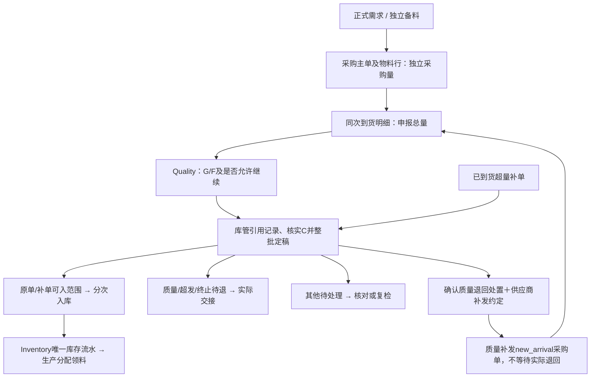

# 采购与外购物料入库设计

本文维护采购到入库的跨模块业务导航，具体字段、状态与命令由 [Procurement](../apps/api/src/modules/procurement/docs/database.md)、[Quality](../apps/api/src/modules/quality/docs/database.md) 和 [Inventory](../apps/api/src/modules/inventory/docs/database.md) 所有者文档维护。实现、待验收与正式测试分别表达，未完成事项见[路线图](roadmap.md)。

| 决策 | 负责的规则与部分取代关系 |
| --- | --- |
| [ADR-0013](adr/0013-procurement-source-and-stock-boundaries.md) | 采购来源、单工单与逐行供应商、采购量和需求独立、实际物流及唯一库存账本。未被后续明确取代的边界继续有效。 |
| [ADR-0014](adr/0014-task-material-policy-and-output-inspection.md) | 任务锁版、研发手工需求和任务执行、损耗与追加需求分离、产出及结案职责；成品质检归 Quality，Production 管理产出和批准清单。取代工单统一锁版等明确旧条款，采购来源仍须是具体正式需求。 |
| [ADR-0015](adr/0015-unified-quality-quantity-semantics.md) | 统一检验事实、来料整批轮次与检后正式分配、来料数量建议及有依据超建议；成品保留独立C，其定稿数量使用非阻断建议；固定已入基准、剩余范围快照及复检开始冻结仍待CQ-01整改。取代 ADR-0013 的独立剔除量、QC 直接可入、检前采购拆批、部分复检与 QC 硬上限；归并 ADR-0014 数量公式，不取代其生产职责和已入类别锁量。 |

成品数量建议已由ADR-0015单独确认，输入职责和依据要求仍以各自所有者文档为准，不能外推到尚未批准的检验类型；成品固定已入基准、剩余范围快照及开始冻结的实现差异保留于[CQ-01](documentation-conflicts.md#cq-01)。基础物料名称、历史展示及稳定身份遵守[数据库公共规则](database-conventions.md#基础物料名称与历史身份)。

## 1. 已确定的边界

- 按需求采购只选择一个工单的正式需求，可同工单跨任务合单；继承具体需求的精确版本。备料采购不依赖工单/任务/BOM，从主数据选择精确物料。两类来源不混单，尚无正式需求时直接关联工单采购后置。
- 供应商逐采购行确定；主单可以多供应商。同物料、精确版本、供应商归并为一行，来源按需求逐条关联。供应商仅名称和稳定ID；名称不存在先维护，不自动造供应商或物料供应商关系。
- 采购量独立填写，不以需求量封顶或分摊。来源保存下单当时关系，后续需求关闭/替代/任务结束不自动改变采购；下单不预留，到货与入库不减需求。生产通过分配和实际领料履约。
- 草稿可改，下单后供应商、物料身份、版本、计划与来源冻结。无到货且无承接事实才可取消；已有事实按逐行结束和后续处置办理，不伪造撤销。
- 物料版本停用仍可采购/检验/入库；Production 选料及领料独立核验用途。基础物料/分类无效与批次冻结/停用仍按已有资格拦截。名称实时展示，编码、单位、精确版本固化。
- 所有外购均有采购来源，待检实物只在到货域记录，不写库存。只有正式清单允许且仓管实际确认后，Inventory写 available 正流水。
- 一期不增加财务、免检、抽样方案配置、破坏性取样或质检到入库的损耗流程。样本不合格不等于整批退货或实际报废。

## 2. 单据关系与办理流程

采购行id精确对应主单、供应商、物料及版本；`material_variants.id` 本身就是精确版本身份，既有item_id通过组合FK验证一致。到货明细保留原采购行作为来源；正式分配可让该次实物分别履约原行及其补单。同一次实物、同一批号只登记一次，不因需求映射或采购拆分重复计量。

到货单可包含同一采购单不同供应商的实际交接行，各明细固定供应商与版本；不同实际批次拆明细。入库单所选范围必须同供应商，可以跨采购单；由服务端解析身份，不能用主单第一行或provider文本替代。

完整主从字段、范围与120件样例见[来料正式清单与采购分配](../apps/api/src/modules/procurement/docs/receipt-acceptance.md)。

## 3. 数量与补单

采购计划量独立于正式需求、到货实收和库存。Quality 保存实检 G/F 与结论，来料数量建议及例外依据由[正式清单](../apps/api/src/modules/procurement/docs/receipt-acceptance.md)完整定义；库管核实本轮未处置实物并承担正式授权责任，实际入退才消耗授权。不得把样本合格数、草稿或检验结果当作库存事实。

超量只有一次真实到货。existing_receipt 补单承接该次实物，不再新增到货或重复质检；quality_replacement/new_arrival 接收新的补发实物，另走完整流程。质量补发须有已确认正式质量退回处置与供应商约定，允许先补后退，不要求先关闭原单。当前身份、冻结和并发门禁见[采购订单](../apps/api/src/modules/procurement/docs/purchase-orders.md)，数值办理案例见[整批例子](../apps/api/src/modules/procurement/docs/receipt-round-examples.md)。

## 4. 状态与职责

到货域负责整批轮次、核对、定稿、独立更正和人工拒收；Quality 负责不可变检查与明确结论，Inventory 仅办理实际库存。复检或独立更正使旧轮未执行授权退出，历史事实与采购归属仍须保留。完整状态和更正门禁见[到货命令](../apps/api/src/modules/procurement/docs/receipts.md)及[正式清单](../apps/api/src/modules/procurement/docs/receipt-acceptance.md)。

库管负责来料实物及处置，成品由产线管理员修正计划内／外和实际报废、工单负责人审批，库管按批准清单确认。成品数量为非阻断建议，但不套用来料的超建议依据输入要求；各自输入职责见[成品检验](../apps/api/src/modules/quality/docs/finished-inspections.md)。

拒收是已登记来货剩余实物的业务决定，不等于实检不合格、实际已退或质量补发资格。拒收、撤销及改量规则由[到货命令](../apps/api/src/modules/procurement/docs/receipts.md)维护，已入库退货仍后置。

## 5. 采购关闭与实际物流

不自动按累计到货或QC量关单。人员逐行确认：当前正式可入余量＋实际已入达到计划时可按达标关闭；真实收齐且质量待退已交接完可按处置完成关闭；少收可等货或留原因人工结束；全部行终态后主单聚合完成。

各采购行只统计归属自己的有效分配和实际事实，不合计历史多版清单，不以补单18凑原单100。关闭不等待实际入库，也不自动把未定稿实物判退；库管仍完成原到货核对/入库/退回。关闭停止新到货，不重开或回改关闭证据。

每个待退范围一次完整实际交接；待退不是已退，退回不写库存。需要进一步拆分须先调整未处置范围。质量待退未退走不阻止已合法放行部分入库。

## 6. 事务、权限与批次

仍为一个API和数据库。来源资格通过public能力；仅登记目录可跨模块只读展示。写入、成功审计、幂等结果和跨模块协作同池同事务，当前轮次、行和范围乐观版本防旧页面提交。锁采购根时按数值顺序包含已关联补单，再到来源范围/Quality/Inventory；数据库锁不跨人工检验过程持有。

首次真实入库生成item_batch并原子绑定到货明细，后续沿用；原单和补单共享同次实物的内部批次。inbound_detail引用实收修订、消费范围、QC及正式分配；inventory_transaction是唯一库存事实，余额可重建。旧无采购外购写入口关闭，历史只读保留。

## 7. 所有者文档与后置范围

- [到货命令与权限](../apps/api/src/modules/procurement/docs/receipts.md)、[查询与候选](../apps/api/src/modules/procurement/docs/receipt-queries.md)、[采购订单](../apps/api/src/modules/procurement/docs/purchase-orders.md)。
- [统一检验模型](../apps/api/src/modules/quality/docs/unified-inspection-model.md)、[来料界面](../apps/admin-web/docs/incoming-inspection-adoption.md)、[成品入库](../apps/api/src/modules/production/docs/database/finished-goods-inbound.md)。

工单提前采购、混合来源单、跨到货合并检验、打印样式、未登记实物的门口拒收、抽样配置及库存退货后置。已登记到货的人工拒收属于当前来料处置。开发库允许重建，结构只追加成对migration，统一db:init恢复，不兼容双写或影子表。
